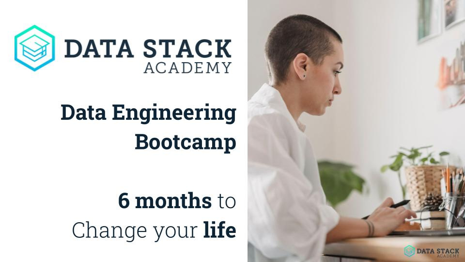

# Data Engineering Bootcamp Sample Chapters

This repository is a small sample of the [Data Stack Academy](https://datastack.academy) bootcamp program.

This sample includes:
- Portions of [Chapter 2](./deb/ch2/): working with files
- [Chapter 4](./deb/ch4/): Working with APIs

### Structure

Each chapter includes a series of episodes. Each episode is roughly one day of instructions and exercises of the bootcamp. Each episode includes:

- **README.md:** daily lesson plan (covered by the instructors)
- **Jupyter Notebooks:** exploratory lesson and exercises for the students to follow 
- **Exercises:** daily exercises similar to the lesson plan for students to complete in pairs
- Data files

### Spread the word

We offer our data engineering bootcamp in multiple cohorts during the year. Our next cohort starts on **August 1st, 2022**. Please help spread the word to friends and family. This bootcamp is geared for non-technical folks making a complete career change.

For more information visit our website: [datastackacademy.com](https://datastack.academy)

Or [download](https://storage.googleapis.com/kitten-storage/DataStackAcademy_brochure_v2022.06.02-md.pdf) a small brochure including the main highlights.

