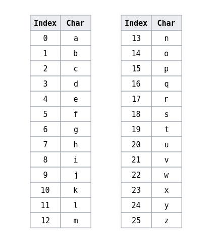

# Data Security: Hashing and Encryption

As data engineers, you'll likely be working with data that needs to be kept secure, like credit card information. While the encryption exercises we're doing here are far from secure enough to use professionally, they're a good occasion to introduce the topic. 

Data is generally kept secure through either hashing or encryption. __Hashing__ takes an input value, passes it through a mathematical algorithm, and returns a hash value. The hashing algorithm is deterministic, meaning that the same inputted value will always get the same outputted value. Hashing is a one-way process: once plaintext is passed through a hash function, it can't be reversed. Hashing is often used to validate the authenticity of various kinds of input. For instance, the hashed values of passwords can be stored in databases, and compared to the hashed value of an inputted password; if they match, that password is correct. Storing passwords as hashes instead of as plaintext words keeps them private even if the database is compromised. Hashing is also used to prove that data hasn't been modified. For instance, Git uses hash functions to identify file changes. Hashing is in the background of much day-to-day security, like encrypting an email, sending a message on your phone, or connecting to an HTTPS website. It's also essential to cryptocurrency. 

Creating hash functions is an advanced topic, and usually left to the likes of the National Security Agency. Once a hash function is shown to be secure, it can become widely used. A common one, [SHA-256](https://en.wikipedia.org/wiki/SHA-2), is used for password hashing in Unix systems and by Bitcoin for verifying transactions. 

<br>

### Exercise
You can generate the SHA-256 hash for a file in the command line, using
```bash
sha256sum <FILENAME>
```
Get the SHA-256 hash for the `secret_message.txt` file. Run the same command again. What do you notice about the hashes? Now, change the contents of the file (just adding or deleting a letter is enough) and save it. Get the hash again. What happened this time?

Repeat the above steps, but this time try the MD5 hash:
```bash
md5sum <FILENAME>
```

<br>

__Encryption__, by contrast, has been designed and used by laypeople since ancient history, and is a reversible process. It allows someone to send a coded message that can (ideally) only be deciphered with a secret key. One of the most famous examples of the use of encryption and cryptanalysis in modern history is that of Alan Turing, a founder of computer science, who deciphered encrypted messages sent during World War II, helping the Allies to win the war. 

Commonly known ciphers used for encryption include the [Vigenere cipher](https://en.wikipedia.org/wiki/Vigenere_cipher), the [Caesar cipher](https://en.wikipedia.org/wiki/Caesar_cipher), and the [Affine cipher](https://en.wikipedia.org/wiki/Affine_cipher). The only truly secure type of cipher, still used in some contexts today despite its impracticality, is encrypting with a one-time pad. Here, we'll be trying the reverse cipher and the Caesar cipher. They're both quite easy to crack, but a good place to start.

# Secret Cipher 1: Reverse Cipher

This exercise will give us practice reading and writing to files, as well as creative problem solving with Python. There are just a few simple steps:

1. There's a file in this directory called 'secret_message.txt'. Feel free to change what the message is!

1. Open and read `secret_message.txt`.

1. Reverse the contents of `secret_message.txt`. 

1. Write the reversed contents to a new file.


There are a lot of ways to do this, so feel free to get creative.


# Secret Cipher 2: The Caesar Cipher

[](./images/calvin_decoder_ring.webp)

This exercise builds on the last secret cipher exercise, but now it gets a little more complicated. This time we'll be using the Caesar cipher, named for Julius Caesar, who reportedly used it to encrypt military messages. You may be familiar with the Caesar cipher if you've ever gotten a secret decoder ring as a prize in a cereal box.

Here's how the Caesar cipher works: 

1. Each letter of the alphabet is assigned an integer to match its index ('a' = 0, 'b' = 1, etc.)

1. An integer between 1-25 is chosen as a secret key 

1. The key is added to the index value of each letter. For instance, if the key is 3, then the new integer assigned to 'b' is 4

1. Each letter in the secret message is replaced by the letter at the new index value. An example will make this clearer:

Let's say your secret message is 'abc', and your key is 2. The index values of the letters in your original message are 0,1, and 2, respectively. If you add 2 to each, the new index values are 2,3,4. If you refer to the letters of the alphabet at the index values of 2,3,4, you get 'cde'. So that's your encrypted message.

#### *Exercise: by hand, encrypt the word "cat" with a key of 4.*

<br>

[](./images/alphabet_index.png)

To reverse the process, the person decrypting the message would need the secret key, so they could subtract that value from the index of each letter in the encrypted message. It's probably obvious why this cipher is quite weak: it would only take 26 attempts to test every possible key. A hassle for a person, but no problem at all for a computer.

#### *Exercise: explain what happens if a key of more than 25 is chosen.*

<br>

[](./images/cipher_wheel.jpg)

#### Write a program that can do the following:

1. Allow the user to choose a key

1. Use `secret_message.txt` as your input file. Feel free to change the text in it

1. Open and read `secret_message.txt` 

1. Encrypt the file using the Caesar cipher

1. Write the output to a new file

1. Repeat the above steps, but decrypting instead of encrypting. A preferred solution would allow a single program to switch between the two, rather than writing a separate program for each.

<br> 

### Notes:

One challenge here is handling wraparound. If the key plus the letter index is more than 25, you'll need a way to start at the beginning of the alphabet again. For instance, if your original message is 'xyz', you're starting with the index values '23,24,25'. If your key is 2, this shifts them to '25,26,27'. But there are no letters with an alphabet index of 26 or 27! So in order to encrypt you'll need to circle back to the start, giving you the letters at indexes '25,1,2', or 'zab'.

Remember that your code should account for spaces, capital vs lowercase letters, punctuation, and other special characters. You can decide how you want to handle these.

Try to make each step of your program a function. You can use the output of one function as the input to another. This makes your code more modular and easier to read and debug, and keeps it from relying too heavily on global variables. 

There are, again, a lot of different ways to solve this challenge. You already have all the necessary tools: dictionaries, lists, and strings (and the methods used on them), arithmatic operators, and control flow. Also check out [Python's built-in `.find()` and `.index()` methods](https://docs.python.org/3/library/stdtypes.html).

__Bonus:__ Write a program that takes a message that's been encrypted with the Caesar cipher, and hacks it using brute force (trying each possible key).

__Bonus:__ The Vigenere cipher builds on the Caesar cipher, and is much harder to crack. Research how it works, and then write a program to encrypt and decrypt text with it.