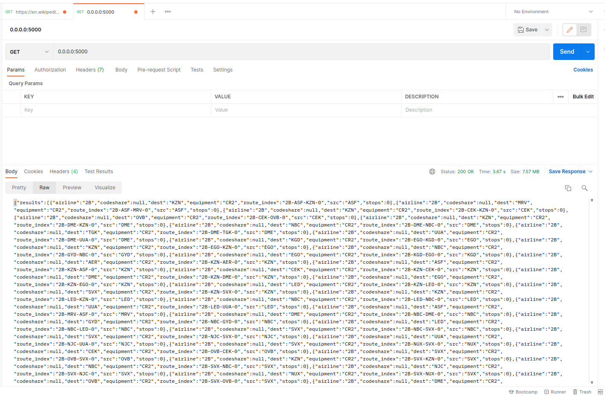
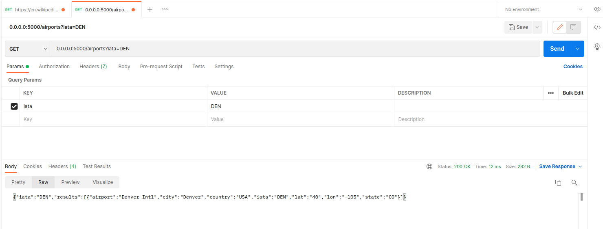
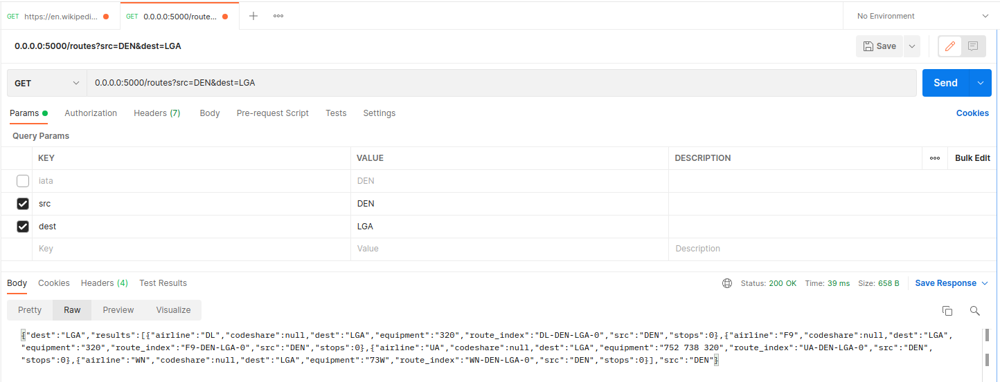

# Building APIs

Now that we're comfortable making requests from APIs, it's time to learn how to make an API of our own. In order to do this, we will use Python's Flask library. This library is designed to create servers that are ready to use as APIs. To start, all we need to do is install Flask using `pip`:

```bash
pip install Flask
```

With this in place, we can build our first Flask API.

# Part 1: Flask API

We're going to build our first simple app similar to the [Flask quickstart](https://flask.palletsprojects.com/en/2.0.x/quickstart/). Our goal will be to make a simple Flask app with a single route that returns the current date. We will walk through the components of this app together. Start by creating a directory called `python/ex1` and within there create Python script called `main.py`. As usual, we start with imports; we only need `datetime` and the `Flask` class from the `flask` library:

```python
from datetime import datetime
from flask import Flask
```

With this class imported, we instantiate our own flask app as simply as:

```python
# Create our Flask app
app = Flask(__name__)
```

There we go! Now that we have an app, we can use it when defining functions. By using `@app.route()` as a function decorator, we bind the function to the endpoint specified by the decorator. What does this mean? It's easiest to see with an example. Let's define a function that returns a very simple HTML block with the current time and use the function decorator to specify that this function will be called when the root endpoint `/` of our API is called:

```python
@app.route("/")
def time_check():
    """
    Simple function that returns the time
    """
    return datetime.now().strftime(format="%A %B %d, %Y")

```

Because of the decorator, our API now knows what function will be called when our root endpoint receives a request; a simple sting is returned. We only have one more step to add to our simple function so we can run it:

```python
if __name__ == "__main__":
    # run flask app on port 5050
    app.run('0.0.0.0', 5050)
```

There we go! Now we can run:

```bash
python main.py
```

We will see terminal output with the following (your local IP will vary):

```bash
 * Serving Flask app "main" (lazy loading)
 * Environment: production
   WARNING: This is a development server. Do not use it in a production deployment.
   Use a production WSGI server instead.
 * Debug mode: off
 * Running on all addresses.
   WARNING: This is a development server. Do not use it in a production deployment.
 * Running on http://192.168.0.226:5050/ (Press CTRL+C to quit)
```

Now that our server is up and running, we can access our API via our favorite source, browser, `cURL`, Postman, python, etc. For example, we can run:

```bash
curl 0.0.0.0:5050
```

and we will get the current day as a string. Similarly, if we navigate to `0.0.0.0:5050` in our browser, we will see a page displaying our current date as a string. And you've done it! You now have a functional API. Let's quickly visit args and headers before building a more complete API.

### Full `main.py`:

```python
from datetime import datetime
from flask import Flask


# Create our Flask app
app = Flask(__name__)


# Create our function with the @app.route() decorator which specifies the endpoint that will call our function
@app.route("/")
def time_check():
    """
    Simple function that returns the time
    """
    return datetime.now().strftime(format="%A %B %d, %Y")
     

if __name__ == "__main__":
    # run flask app on port 5050
    app.run('0.0.0.0', 5050)
```

<br/>

## Practice: Multiple Routes

You can easily define multiple routes (or endpoints) in a Flask app. Open the [practice-notebooks/01_multiple_routes.ipynb](practice-notebooks/01_multiple_routes.ipynb) and follow its instructions. 

Don't forget to complete the exercise at the end of this notebook.

<br/>

## Practice: Multiple Methods

Flask routes can also easily respond to multiple HTTP methods like GET or POST. Open the [practice-notebooks/02_01_multiple_routes.ipynb](practice-notebooks/02_multiple_routes.ipynb) and follow its instructions. 

Don't forget to complete the exercise at the end of this notebook.

<br/>

## Add **args** and **headers**

Now that we have a basic Flask app, let's take a look at how Flask handles args and headers so our routes can be more useful. Make another directory called `ex2` and copy over your `main.py`. To start, we need to add one more import: `flask.request`:

```python
from datetime import datetime
from flask import Flask, request
```

`request` gives us a way to access the [request](https://flask.palletsprojects.com/en/2.0.x/api/?highlight=request#flask.request) that our app receives. This object packages together all the incoming information into an easily accessible [**Request** object](https://flask.palletsprojects.com/en/2.0.x/api/?highlight=request#flask.Request). Of note to us, we can access any input parameters with `request.args` and all the headers with `requests.headers`. These behave like standard Python `dicts` making value accessing a breeze. Let's revisit our date returning endpoint and add to new features: the ability to supply the date format as a parameter called `format` and the ability to return our string in a JSON if the `Accepts` header specifies `application/json` (a common header). We do not need to add any input arguments to our function, we can simply access these values using `requests.args.get()` and `request.headers.get()`:

```python
@app.route("/")
def time_check():
    """
    Simple function that returns the time. Can accept a format string.
    Returns a raw sting unless the header specifies JSON
    """
    # We can access the request args via flask.request.args. We get() the desired format and specify a default if the arg is not provided
    date_format = request.args.get("format", default="%A %B %d, %Y")
    
    cur_day =  datetime.now().strftime(format=date_format)
    # The request headers are accessible through flask.request.headers. We use .get() to see if it only accepts JSON
    if request.headers.get('Accept', default=None) == 'application/json':
        # return a dict with is interpreted as json
        return {
            'date': cur_day
        }
    else:
        return cur_day
```

If we run our new Flask app as before, we can still access it via `cURL` but we can specify the desired date format:

```bash
curl 0.0.0.0:5050/?format=%Y-%m-%d-%H:%M:%S
```

or we can specify we would like JSON back:

```bash
curl -H "Accept: application/json" 0.0.0.0:5050/
```

With this first API created, we're ready to move on to making a more robust API to access our airline data.

### Updated `main.py`:

```python
from datetime import datetime
from flask import Flask, request


# Create our Flask app
app = Flask(__name__)


# Create our function with the @app.route() decorator which specifies the endpoint that will call our function
@app.route("/")
def time_check():
    """
    Simple function that returns the time. Can accept a format string.
    Returns a raw sting unless the header specifies JSON
    """
    # We can access the request args via flask.request.args. We get() the desired format and specify a default if the arg is not provided
    date_format = request.args.get("format", default="%A %B %d, %Y")
    
    cur_day =  datetime.now().strftime(format=date_format)
    # The request headers are accessible through flask.request.headers. We use .get() to see if it only accepts JSON
    if request.headers.get('Accept', default=None) == 'application/json':
        # return a dict with is interpreted as json
        return {
            'date': cur_day
        }
    else:
        return cur_day


if __name__ == "__main__":
    # run flask app on port 5050
    app.run('0.0.0.0', 5050)
```

<br/>

## Practice: Response Tuple

The return method on a Flask route can send back the data, HTTP status code, and its headers to the client by returning a tuple. You can see this in an example. Open the [practice-notebooks/03_response_tuple.ipynb](practice-notebooks/03_response_tuple.ipynb) and follow its instructions. 

Don't forget to complete the exercise at the end of this notebook.

<br/>

## Practice: GET args

Flask routes can accept any number of GET args and you can easily access them by using the `flask.request` class. You can see this in action. Open the [practice-notebooks/04_get_args.ipynb](practice-notebooks/04_get_args.ipynb) and follow its instructions. 

Don't forget to complete the exercise at the end of this notebook.

<br/><br/>

# Part 2: Airport API

Let's make a more useful API to retrieve our airline data. Our goal will be to make an API that can return both **route** and **airport** information via GET requests. The first step on this process is to have our data available to serve these requests.

## Set up database
Luckily, we're going to use the same MariaDB database from previous chapters. This database should have tables for _airlines, airports, routes, and aircrafts_. Feel free to use the same database or follow the setup instructions below.

### Setup
We've included a few db scripts to start and populate the data that we need for this lesson. There should be three scripts:

- `db_start.sh`: start and populates a docker database container with our airspace tables
- `db_stop.sh`: completely wipes the existing docker container including its data
- `db_check.sh`: checks to see if the database is up and ready to use. MariaDB takes a few seconds to start up; you can run this scrip to check if everything is running.

You can run the following script to start the database:

```bash
./start_db.sh
```

We will need a database config file which includes the information used to connect to our db container. Save the following as `config.yml`... Double check this with the information inside the `start_db.sh`:

```yaml
user: root
pswd: mysql
host: localhost:3306
database: dsadeb_flights
```

This way we can have our Flask app create an SQL client that can access our database.

## Flask route for all airline "routes"
With our database up and running, we will begin by making a route that will return all our airline routes (nice overloading of the term _route_). Make a directory called `ex3` and start a new `main.py`. We're going to need a few more imports this time; we will be logging as usual and we will want to be able to parse our args to find and load our configuration all on top of Flask and SQLAlchemy we will be using to access our data. Here are the needed imports followed by our logger and util functions:

```python
import logging
import argparse
import yaml
import sys
from sqlalchemy import create_engine, text
from sqlalchemy.pool import QueuePool
from flask import Flask, current_app, request

# setup logging and logger
logging.basicConfig(format='[%(levelname)-5s][%(asctime)s][%(module)s:%(lineno)04d] : %(message)s',
                    level=logging.INFO,
                    stream=sys.stderr)
# alias logging as logger
logger: logging.Logger = logging


def set_args():
    """
    Parse args and read config file
    """
    parser = argparse.ArgumentParser(description="Airspace API Parser")
    parser.add_argument("-c", "--config", help="Path to config yaml file", default="config.yml", required=False)
    args,_ = parser.parse_known_args()
    return args


def load_config(path_to_yaml):
    """
    Function to parse args out of a yaml file
    """
    with open(path_to_yaml) as open_yaml:
        return yaml.full_load(open_yaml)
```

With those functions defined, we can parse our args to find the path to our config file, load it and create both our Flask app and SQLAlchemy Engine:

```python
# set cmd line args & load configuration
args = set_args()
conf = load_config(args.config)

# get db config params
db_host = conf['host']
db_user = conf['user']
db_pswd = conf['pswd']
db_name = conf['database']
# print db params (never print passwords!)
logger.info(f"flask mysql config: host={db_host} user={db_user} db={db_name}")
logger.info(f"starting flask app")


# create flask app and sqlalchemy engine
app = Flask(__name__)
# create a db engine with a connection pool
#   a QueuePool creates a pool of database connections. Since routes could be called by multiple clients
#   simultaneously, having a pool of db connection that we could pull from is a good idea. Please refer
#   to the create_engine documentation.
engine = create_engine(f"mysql+pymysql://{db_user}:{db_pswd}@{db_host}/{db_name}?charset=utf8", 
                       poolclass=QueuePool, pool_size=5, max_overflow=0)

# save the engine into the flask app cache to be accessed later
app.config['engine'] = engine
```

**NOTE**:

A few things to **note** about this code snippet:
- After loading our config file, we retrieve our db connection param: db_host, db_user, ...
- Our Flask app is created as usual under a variable called `app`
- Our SqlAlchemy engine is created with some more args than usual:
  - `poolclass` defines a connection pool class to use. Since flask app routes can be called from multiple clients simultaneously, it's common practice to have a pool of connection that can be used as the same time. This helps our app to be able to respond to multiple API calls and rotate between the connection. The `QueuePool` is a built-in SqlAlchemy class which round robins between a number of open connections. The connection are cached and can be access simultaneously. This is a **pro** move 😉
  - `pool_size` defines a number of connection in our pool. Depending on how often your API is used, 5 or 10 is a good common value for this. Creating too large of a pool can cause issues with the database.
  - `max_overflow` set the number of backup connections to add to the queue if all our connection ends up being used simultaneously. Since we're not anticipating too much use for this API, we'll set this to 0.
  - You can learn more about this on [SqlAlchemy Connection Pool documentation](https://docs.sqlalchemy.org/en/14/core/pooling.html).
- Finally, we save our SqlAlchemy engine into the `app.config` cache. Again, since flask apps are **multi-threaded** (meaning they are access on different threads of our code simultaneously) it's common practice to save this into the cache. We can access the current (thread) app via the Flask `current_app` class which we **imported** in our `import` statement.

<br/>

And those are the pieces we need to create our route returning route! We will be setting this as our default endpoint in our decorator. We then use the SQLAlchemy connection to query our database for all route information then formats those as rows and then loops over those rows to create a nested `dict` we can return as JSON:


```python
@app.route('/')
def all_routes():
    """main GET route to return all routes"""
    # it's NOT good practice to access the global flask `app` variable
    #  -- instead use the imported `current_app` flask class
    engine = current_app.config['engine']
    logger.info(f"query db for all routes")
    # get a new connection
    with engine.connect() as conn:
        # Return all routes from our database
        logger.info(f"returning all routes")
        result = conn.execute(
            text("select airline, src, dest, codeshare, stops, equipment from routes order by airline")
        )
        # get all the resulting db rows as dict (or mappings)
        rows = result.mappings().all()
        # use a list and dict comprehenssion to return all the rows
        return {
            'results': [{k: v for k, v in row.items()} for row in rows]
        }
```

**NOTE**:
- We retrieve our db engine from the flask `current_app.config` class. Remember that we added this to our cache before.
- We use the `engine.connect()` method to get a connection from our **Pool**.
- We use the `conn.execute()` method to execute a SQL query and get the results.
- The `result.mappings().all` SqlAlchemy method is used to convert our results as a list of rows with each row's columns  mapped into a dict. This will map the db columns and their values into a key/value pair of dict.
- Think of a row being a dict like corresponding to our table columns and values:

    ```json
    {
        "airline": "2B",
        "codeshare": null,
        "dest": "KZN",
        "equipment": "CR2",
        "src": "ASF",
        "stops": 0
    }
    ```
- And we have a list of dicts for each row in the database.
- The final `return` statement uses a pretty complex _combination_ of list and dict **comprehensions** to return the results as a list of dicts:
  - The outer **list comprehension**: `[{...} for row in rows]` iterates through our list and return a dict
  - The inner **dict comprehension** `{k: v for k, v in row.items()}` iterates through the key/value items of our dict and maps them to themselves: `k: v`
  - Yes, this is pretty advanced python 😊
  - The result again would be a list of dicts.
- We will use this technique again later. This is a **pro** code snippet to convert resulting rows from a SQL query into a JSON dict to return in APIs 😉
- Please feel free to ask the instructor if you have trouble following this code.

<br/>

If we add a `if __name__ == "__main__"` to the end, we can test our endpoint with Postman!

```python
if __name__ == "__main__":
    # run flask app on port 5000
    app.run('0.0.0.0', 5000)
```

All we need to do is enter the host and port into our url and make a GET request:



Similarly, we can use `cURl` if we want to dump a lot of JSON into our terminal:

```bash
curl -X GET "http://localhost:5050/"
```

And there we have our first useful API that can query data from our database and return it to the requester! 

Next, let's add a route for airport data that takes advantage of the `request.args` to return specific airports.

## Return specified airport or all airports

This route is going to be very similar to the `routes` route, but we want to actually support querying a specify airport. We will start by defining a function called `airport()` and giving it an endpoint; let's go with `/airports` for easy of remembering:

```python
@app.route('/airports')
def airport():
    """ GET route to search and return a airport by iata code"""
```

For this function, the first step is to get the argument `iata` from our request if specified and setting up our engine as before:

```python
    # get the GET arg called iata
    iata = request.args.get('iata', default=None)
    logger.info(f"query db for iata: {str(iata)}")
    # get the db engine form config
    engine = current_app.config['engine']
```

Once we have the `iata` code or `None` if one was not supplied, we can set up the query we need. If an `iata` code is specified, we can use that to query our database for the matching airport, returning it or an empty list if that airport is not present:

```python
    # create a new connection
    with engine.connect() as conn:
        # if the user has specified an iata GET arg
        if iata is not None:
            # search for specific iata airport code
            result = conn.execute(
                text("select iata, airport, city, state, country, CAST(lat AS CHAR) lat, CAST(lon AS CHAR) lon from airports where iata = :iata"),
                {'iata': str(iata).strip().upper()}
            )
            result = result.mappings()
            # inspect the first row. Do we have any rows matching the iata code provided?
            row = result.first()
            if row is not None:
                # return a single airport result
                return {
                    'iata' : iata,
                    'results': [{k: v for k, v in row.items()}]
                } 
            else:
                # airport code not found, return empty list
                return {
                    'iata' : iata,
                    'results': []
                }
```

**NOTE:**
- We use the `result.first()` method to inspect if we did get a matching row for the iata code provided.
- If there are no matching rows, this method returns `None`.
- We use the same list/dict comprehension technique to convert our db results into JSON

<br/>

In the case that no `iata` code was supplied, we will default to returning *all* airport rows which is the same query but with no **where** clause:

```python
        # if the user has NOT specified an iata GET arg
        else:
            # no iata code provided, return all airports
            logger.info(f"returning all airports")
            result = conn.execute(
                text("select iata, airport, city, state, country, CAST(lat AS CHAR) lat, CAST(lon AS CHAR) lon from airports order by iata")
            )
            rows = result.mappings().all()
            return {
                'iata' : iata,
                'results': [{k: v for k, v in row.items()} for row in rows]
            }
```

Putting all these pieces together gives us the following function for our `/airport` route:


```python
@app.route('/airports')
def airport():
    """ GET route to search and return a airport by iata code"""
    # get the GET arg called iata
    iata = request.args.get('iata', default=None)
    logger.info(f"query db for iata: {str(iata)}")
    # get the db engine form config
    engine = current_app.config['engine']
    # create a new connection
    with engine.connect() as conn:
        # if the user has specified an iata GET arg
        if iata is not None:
            # search for specific iata airport code
            result = conn.execute(
                text("select iata, airport, city, state, country, CAST(lat AS CHAR) lat, CAST(lon AS CHAR) lon from airports where iata = :iata"),
                {'iata': str(iata).strip().upper()}
            )
            result = result.mappings()
            # inspect the first row. Do we have any rows matching the iata code provided?
            row = result.first()
            if row is not None:
                # return a single airport result
                return {
                    'iata' : iata,
                    'results': [{k: v for k, v in row.items()}]
                } 
            else:
                # airport code not found, return empty list
                return {
                    'iata' : iata,
                    'results': []
                }
        # if the user has NOT specified an iata GET arg
        else:
            # no iata code provided, return all airports
            logger.info(f"returning all airports")
            result = conn.execute(
                text("select iata, airport, city, state, country, CAST(lat AS CHAR) lat, CAST(lon AS CHAR) lon from airports order by iata")
            )
            rows = result.mappings().all()
            return {
                'iata' : iata,
                'results': [{k: v for k, v in row.items()} for row in rows]
            }
```

We can once again test quickly with Postman or `cURL`:



or

```bash
curl -X GET "http://localhost:5050/airports?iata=DEN"

{"iata":"DEN","results":[{"airport":"Denver Intl","city":"Denver","country":"USA","iata":"DEN","lat":"40","lon":"-105","state":"CO"}]}
```

This shows how easy it is to parse the args from `request` and use them in a query. 

<br/>

### NOTE: SQL Injection Hacks!

Note that using a **parameterized SQL query** like `"where iata = :iata"` protects us against a hack called **SQL Injection**. This is where a hacker provides malicious SQL code as the iata GET parameter. If our query is not smart, it will execute this SQL code as part of the where clause. You can research more about SQL Injection and tell the class for additional points. SQL Injection is a **real** thing and hackers use them all the time! Another **pro** tip 😉

Just to demonstrate think what if a hacker provided the following value as the iata GET arg:

```sql
"DEN"; DROP ALL TABLES;
```

This code will end our SQL WHERE clause with "DEN" and then executes a DROP ALL TABLES which will completely wipe our database! Yes, it's pity hack but it works if we didn't use **parametrized queries** and constructed our query using a f-string like:

```sql
... where iata = '{iata}'"
```

**No bueno!**

<br/>

## Return routes based on source and destination

Now that we're comfortable using the `args`, lets add a `/routes` endpoint that can take a source and/or destination and return all associated routes we have in our database. Wit the goal, we start very similarly to  our `/airports` route by parsing our request args and setting up a quick `dict` for use in our SQLAlchemy queries:

```python
@app.route(('/routes'))
def get_route():
    """
    GET route that returns airline routes based on source and destination
    """
    # get src and dest GET args
    #   -- if provided, create a dict that we will use as parameters to our 
    #      sql statement
    src = request.args.get("src", default=None)
    dest = request.args.get("dest", default=None)
    sql_query_params = {
        "src": str(src).strip().upper(),
        "dest": str(dest).strip().upper(),
        }
```

With the `src` and `dest` ready, we can set up our 4 cases to query. For each combination of specified value, we create the corresponding query string and use our SQLAlchemy connection to get the result from our database. If neither `src` or `dest` are supplied, we can default to returning all `routes` which we can accomplish from our existing `all_routes() function. We then just need to format our results and return them.
Putting these cases together gives us the following route function:

```python
@app.route(('/routes'))
def get_route():
    """
    GET route that returns airline routes based on source and destination
    """
    # get src and dest GET args
    #   -- if provided, create a dict that we will use as parameters to our 
    #      sql statement
    src = request.args.get("src", default=None)
    dest = request.args.get("dest", default=None)
    sql_query_params = {
        "src": str(src).strip().upper(),
        "dest": str(dest).strip().upper(),
        }
    engine = current_app.config['engine']
    with engine.connect() as conn:
        if src and not dest:
            # just src provided, returning all routes for that source
            logger.info(f"Returning all routes from {src}")
            result = conn.execute(
                        text("select airline, src, dest, codeshare, stops, equipment from routes where src = :src order by airline"),
                        sql_query_params
                    )
        elif dest and not src:
            # just dest provided, return all routes with that destination
            logger.info(f"Returning all routes to {dest}")
            result = conn.execute(
                        text("select airline, src, dest, codeshare, stops, equipment from routes where dest = :dest order by airline"),
                        sql_query_params
                    )
        elif src and dest:
            # both provided, return flights from src to dest
            logger.info(f"Returning all routes from {src} to {dest}")
            result = conn.execute(
                        text("select airline, src, dest, codeshare, stops, equipment from routes where src = :src and dest = :dest order by airline"),
                        sql_query_params
                    )
        else:
            # no source/dest provided, return all
            logger.info(f"No src or dest provided")
            return all_routes()    
    
    rows = result.mappings().all()
    return {
        'src': src,
        'dest': dest,
        'results': [{k: v for k, v in row.items()} for row in rows]
    }
```

And as usual, we can test the output via Postman or `cURL`:



or 

```bash
curl -X GET "http://localhost:5050/routes?src=DEN&dest=LGA"
```

And there we have it! A functional API to retrieve our airspace data! With these GET requests in place, we're ready to learn how to add POST requests to our API in the next episode.

## Conclusion

Take a moment to digest the following techniques used here:
1. Creating a engine with connection pools
2. Saving things into `app.config` cache
3. Retrieving them via `current_app` class
4. Using parametrized queries such as `"where iata = :iata"`
5. Using `result.mappings().all()` method of SqlAlchemy. [Documentation](https://docs.sqlalchemy.org/en/14/core/connections.html#sqlalchemy.engine.CursorResult.mappings).
6. Using list and dict comprehensions to convert SqlAlchemy results into a JSON