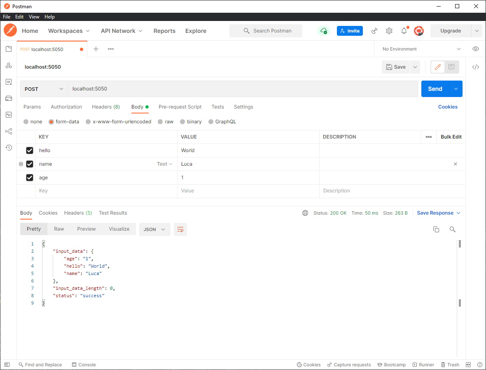
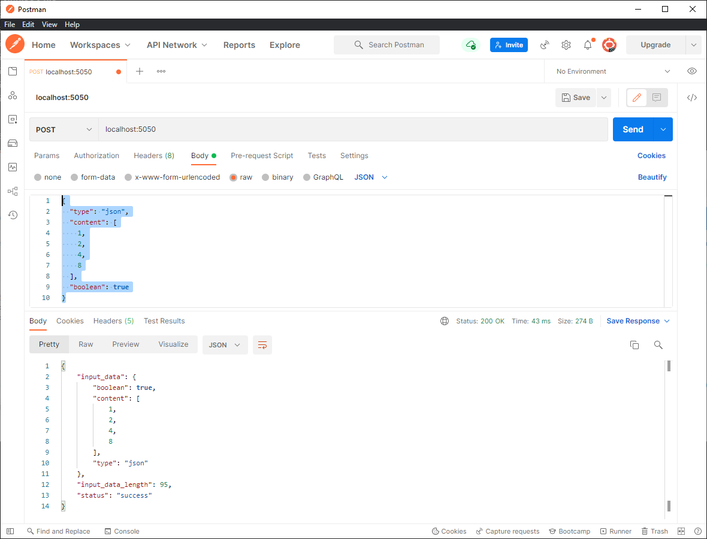
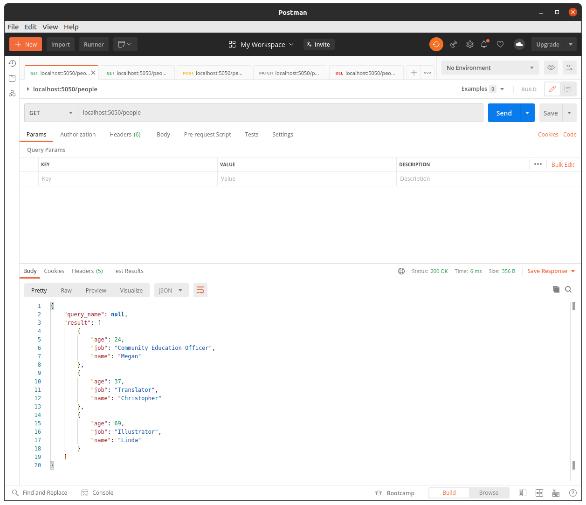
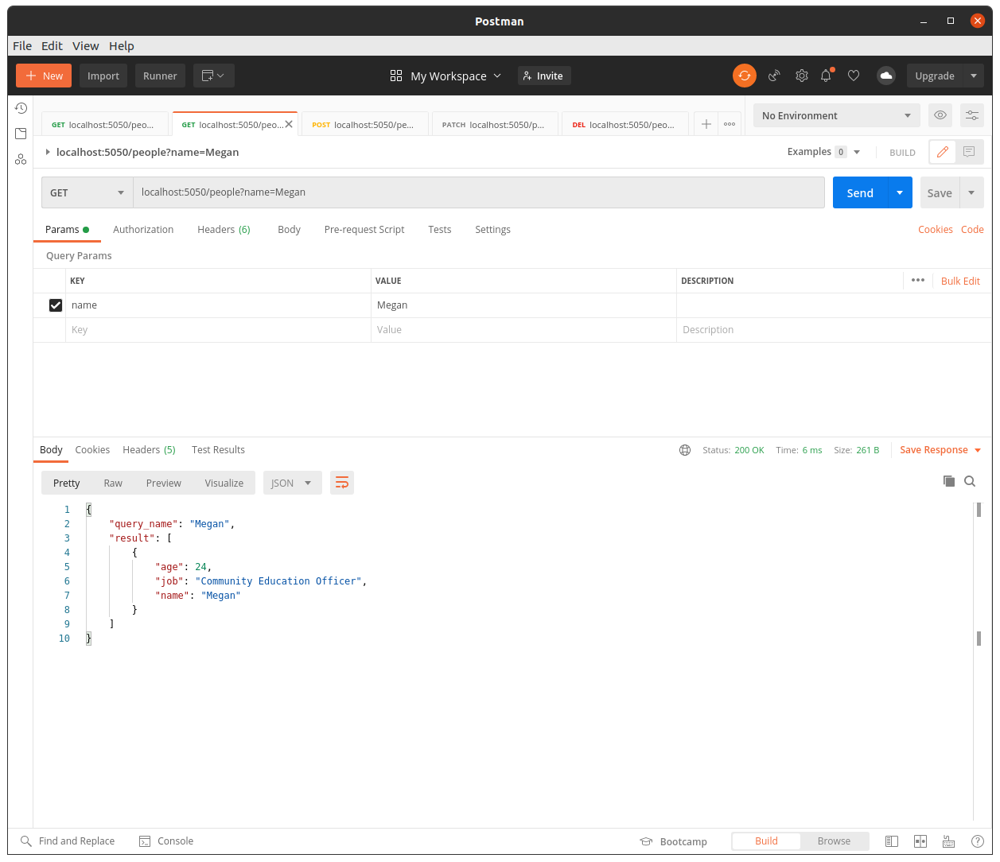
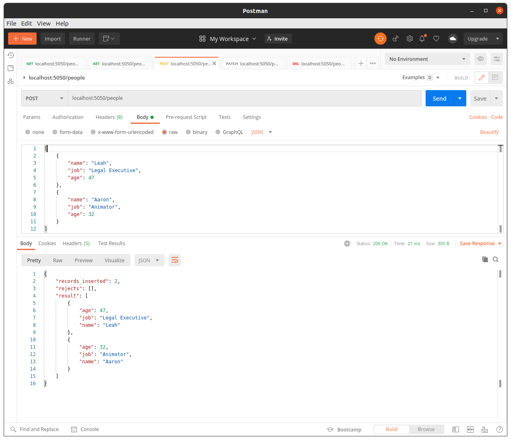
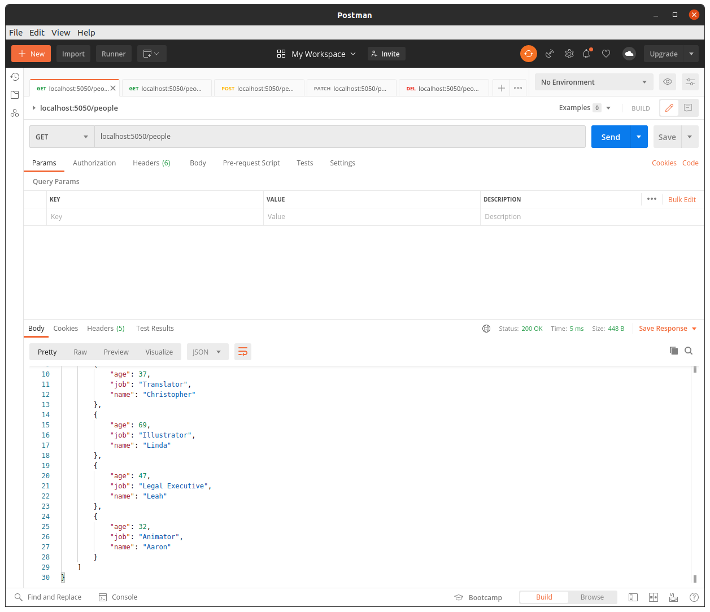
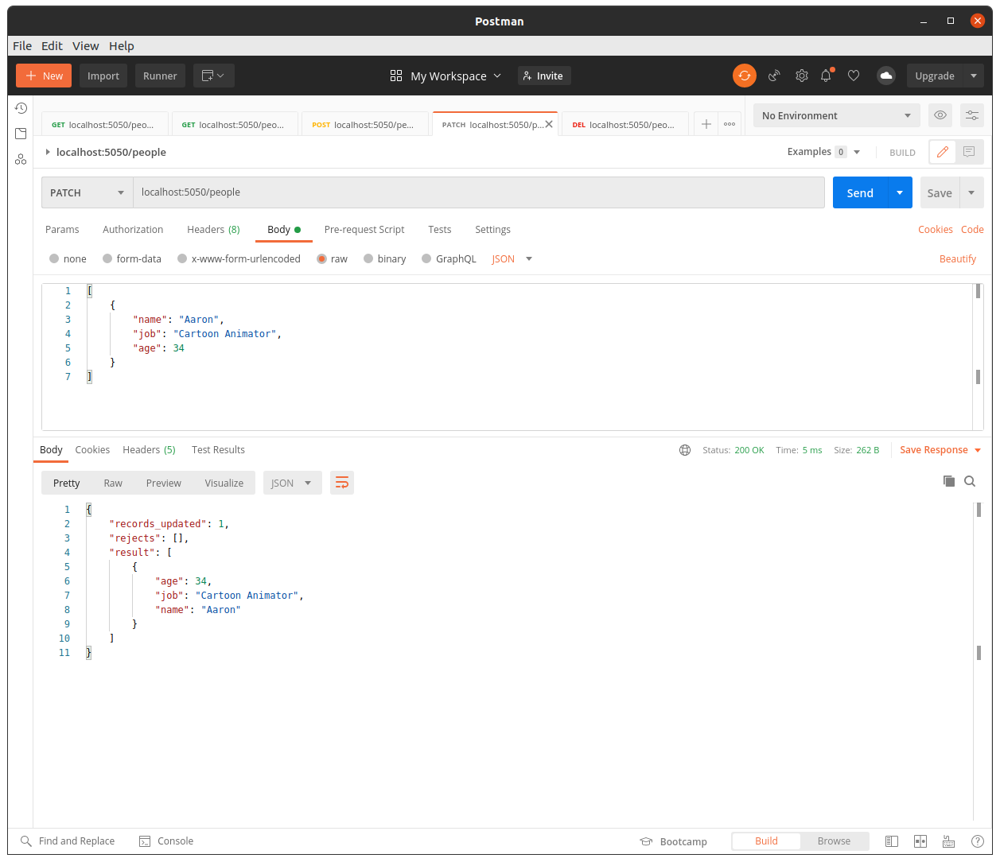
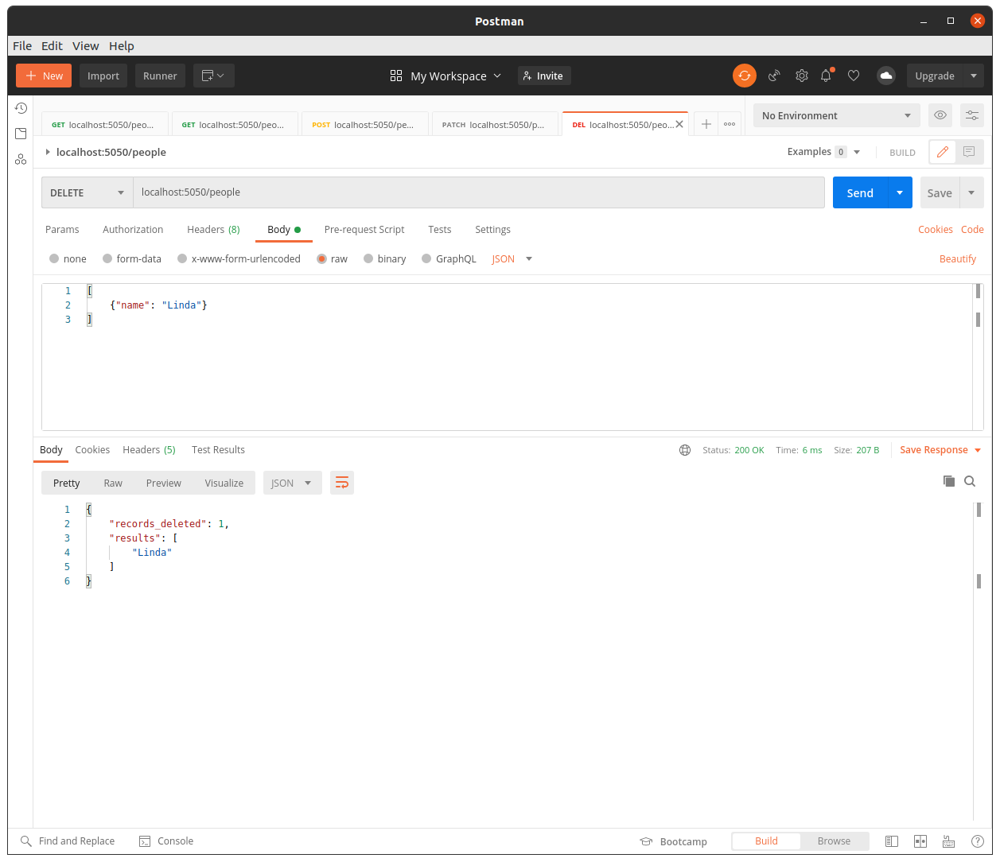

# CRUD APIs

APIs are commonly used to provide a method to interact with data on databases or the Cloud. They provide clients with methods to query to edit the data. Providing direct access to databases is always very risky and databases provide little protection against basic user errors or malicious activities. By providing APIs:
- We create an abstraction layer between the user and the database
- This abstraction layer provides a series of standard methods to interact with the data
- Even if the underlying data structures changes, the APIs could remain the same; enabling client applications to remain unchanged 
- APIs can easily be upgraded to provide new features (or versions) independently
- We can also protect the database against user errors. Implement safe-guards to ensure the user data is clean and correct before they are added to the database

These are some advantages of building APIs. The disadvantage is that we need to implement and thoughtfully design the APIs.

<br/>

There's a common terminology in building APIs called **CRUD** which stands for Create, Read, Update, and Delete. We typically implement a series of _CRUD_ methods for every data entity (table) to read, insert, update, and delete records. You've already seen how the HTTP _GET_ method is used to read data thru an API; respectively HTTP:
- _POST_ method is used to insert new data
- _PUT_ or _PATCH_ methods are used to update or replace data
- _DELETE_ method is to delete data

In this lesson, you'll learn how to build APIs for _POST_, _PATCH_, _DELETE_ methods to insert, update, and delete data.

<br/><br/>

## Part #1: Accepting POST Requests

Flask easily supports POST requests. The type of request Flask received is stored in `request.method`. Our function can use this to know whether a POST, GET, or other method was used and perform accordingly. Also, when we use our `@app.route` decorator, we can specify the supported methods of our function using the `methods=` argument followed by a text listing of the supported methods.

Now, let's go over an example to demonstrate how we can receive _POST_ data using Flask:

<br/>

Open the code in [`python/ex1/main.py`](python/ex1/main.py):

```python
import json
import sys
import logging
from flask import Flask, request


# setup logging and logger
logging.basicConfig(format='[%(levelname)-5s][%(asctime)s][%(module)s:%(lineno)04d] : %(message)s',
                    level=logging.INFO,
                    stream=sys.stderr)
logger: logging.Logger = logging

# Create our Flask app
app = Flask(__name__)


# Specify that our route supports GET and POST methods
@app.route("/", methods=["GET", "POST"])
def print_data():
    """
    Simple function that prints the supplied data
    """
    # If we receive a GET method, we want to respond saying how to use the POST method
    if request.method == "GET":
        return "Please send a POST message to this endpoint and we will print the supplied data", 200
    else:
        # Get the type of data from the headers if supplied
        data_type = str(request.headers.get("Content-Type", None)).lower()
        logger.info(f"Our Content-Type is: {data_type}")
        # response json result as a dict
        result = {"status": "success"}

        # If we got form data, print with nice formatting and return success
        if data_type.startswith("multipart/form-data"):
            # empty dict to hold input form data
            result["input_data"] = {}
            for key, val in dict(request.form).items():
                logger.info(f" form {key}: {val}")
                result["input_data"][key] = val
        # If we receive JSON data, print it and return success
        elif data_type == "application/json":
            json_data = request.json
            logger.info(json.dumps(json_data, indent=2))
            result["input_data"] = json_data
        
        # add the request length and send back the response
        logger.info(f"POSTed {len(request.data)} bytes")
        result["input_data_length"] = len(request.data)
        # send the response back as json
        return result, 200, {"Content-Type": "application/json"}


if __name__ == "__main__":
    # run flask app on port 5050
    app.run('0.0.0.0', 5050)

```

<br/>

**Let's break this code down section by section**

<br/>

### Setup & Content-Type Header

As usual, we start by doing out imports and setting up the flask app:

```python
import json
import sys
import logging
from flask import Flask, request


# setup logging and logger
logging.basicConfig(format='[%(levelname)-5s][%(asctime)s][%(module)s:%(lineno)04d] : %(message)s',
                    level=logging.INFO,
                    stream=sys.stderr)
logger: logging.Logger = logging

# Create our Flask app
app = Flask(__name__)


# Specify that our route supports GET and POST methods
@app.route("/", methods=["GET", "POST"])
def print_data():
    """
    Simple function that prints the supplied data
    """

    # If we receive a GET method, we want to respond saying how to use the POST method
    if request.method == "GET":
        return "Please send a POST message to this endpoint and we will print the supplied data", 200
    else
        # Get the type of data from the headers if supplied
        data_type = str(request.headers.get("Content-Type", None)).lower()
        logger.info(f"Our Content-Type is: {data_type}")
        # response result as a dict
        result = {"status": "success"}
```

- We check `request.method` to see what type of request we got 
- If it is a GET request, we can respond back to remind the user to use a POST method instead
- In our `else`, we will access the POSTed data and log it. But how will know what the format of the data we receive and therefore how best to access it? That's where the HTTP **"Content-Type" Header** comes in to help
- Pay attention, that we create a dict called `result` to send back to the client as the result of calling the API. We initiate this dict with _status: "success"_ message and we'll add other response elements later in our code.

There are many [different standard content types](https://en.wikipedia.org/wiki/Media_type) we can specify with this header but let's focus on two common ones that store the data differently in our `request`:

<br/>

## Form Payload: `multipart/form-data` Content-Type

This is the standard Content-Type from any HTML **Form** and comes in key-value pairs. If we receive form data, we can access it from `request.form` which is a dict-like object storing the values. The header also contains a specification of the boundary of the form items but we don't need to use that for anything. If our header starts with `multipart/form-data`, let's loop over the key-value pairs and log them. We'll also add the form data to our _result_ response dict:

```python
        # If we got form data, print with nice formatting and return success
        if data_type.startswith("multipart/form-data"):
            # empty dict to hold input form data
            result["input_data"] = {}
            for key, val in dict(request.form).items():
                logger.info(f" form {key}: {val}")
                result["input_data"][key] = val
```

**NOTE:**
- Our `result` dict (or JSON return object) is updated with a new key called `"input_data"`.
- We iterate through our form data (as a dict) and add the same key/value pairs to our `result`

<br/>

## JSON Payload: `application/json` Content-Type

We've seen this one before! It is used to specify that JSON data is being supplied and is available through the `request.json` attribute. We can use the `json` module to format and then log any JSON data we receive:

```python
        # If we receive JSON data, print it and return success
        elif data_type == "application/json":
            json_data = request.json
            logger.info(json.dumps(json_data, indent=2))
            result["input_data"] = json_data
```

**NOTE:**
- The `request.json` attribute returns the entire request body as a JSON dict object.
- We're using the `json.dumps()` method to print the data received as string.
- The input json dict is copied as-is to the `result["input_data"]` dict.

<br/>

## Response

At the end, let's simply log the size of the data we received in the POST request. The attribute `request.data` is the raw bytes we received so we can simply log its length. We are now ready to send the response back. We can send the response back as a tuple: 

- The first element is the _result_ dict. This will be interpreted by Flask as JSON.
- The second element represents the HTTP response code _200_. Indicating a successful HTTP call.
- The third element sets the response HTTP headers. We indicate here that we return a json response by setting the _Content-Type_ header.

```python
    # add the request length and send back the response
        logger.info(f"POSTed {len(request.data)} bytes")
        result["input_data_length"] = len(request.data)
        # send the response back as json
        return result, 200, {"Content-Type": "application/json"}
```

<br/>

Start up our new server using `python main.py` as usual. Postman makes testing POST routes incredibly easy so we will use that. To test the form, simply select POST from the drop down of request types, enter our API url, and then click on the **Body** tab. Within this tab there is a button for **form-data**, click this and fill out a few key value pairs and click send! We don't even have to worry about specifying headers, Postman automatically supplies the `Content-Type` based on the body tab we select:



In addition to the text response, we can check the output in our terminal to see where the POSTed form data was logged:

```bash
[INFO ][2022-05-15 14:23:48,027][main:0029] : Our Content-Type is: multipart/form-data; boundary=--------------------------456233941612664220114301
[INFO ][2022-05-15 14:23:48,049][main:0040] :  args hello: World
[INFO ][2022-05-15 14:23:48,049][main:0040] :  args name: Luca
[INFO ][2022-05-15 14:23:48,050][main:0040] :  args age: 1
[INFO ][2022-05-15 14:23:48,050][main:0049] : POSTed 0 bytes
[INFO ][2022-05-15 14:23:48,050][_internal:0224] : 127.0.0.1 - - [15/May/2022 14:23:48] "POST / HTTP/1.1" 200 -
```

Similarly, for JSON data, we can select the **raw** tab, select JSON in the drop down at the end and write a little JSON object to POST:

Raw JSON body data:
```json
{
  "type": "json",
  "content": [
    1,
    2,
    4,
    8
  ],
  "boolean": true
}
```



```bash
[INFO ][2021-10-01 11:46:28,430][main:0037] : Our Content-Type is: application/json
[INFO ][2021-10-01 11:46:28,430][main:0046] : {
  "type": "json",
  "content": [
    1,
    2,
    4,
    8
  ],
  "boolean": true
}
```

We can also use [`cURL` to make POST requests](https://everything.curl.dev/http/post) by setting the `-X POST` flag. We use the `-d` flag to supply data; for example if we want to send JSON we can do the following (don't forget your header!):

```bash
curl -X POST -H "Content-Type: application/json" -d '{"type": "json", "source": "cURL"}' "http://localhost:5050/"
```

And we will see the expected log in our Flask terminal:

```bash
[INFO ][2021-10-01 12:15:47,541][main:0037] : Our Content-Type is: application/json
[INFO ][2021-10-01 12:15:47,541][main:0046] : {
  "type": "json",
  "source": "cURL"
}
```


If we want to send form data, we can send each field with the `--form` or `-F` flag(which also automatically sets our header as well):

```bash
curl --form name=Beth --form age=45 "http://localhost:5050/"
```

Output:

```bash
[INFO ][2022-05-15 14:35:57,778][main:0029] : Our Content-Type is: multipart/form-data; boundary=------------------------a9f21acf3ef69b40
[INFO ][2022-05-15 14:35:57,780][main:0040] :  args name: Beth
[INFO ][2022-05-15 14:35:57,780][main:0040] :  args age: 45
[INFO ][2022-05-15 14:35:57,781][main:0049] : POSTed 0 bytes
```

<br/><br/>

## Part 2: Building CRUD APIs

Now that we have a basic understanding on how to handle POST requests, let's build a more comprehensive API that implements the full CRUD operation. In this section, we're going to build an API that manages a set of people. Our API will provides methods to:
- **C**REATE: Add new people to our database _(HTTP POST)_
- **R**EAD: Read and query for existing people in our database _(HTTP GET)_
- **U**PDATE: Update existing people _(HTTP PATCH)_
- **D**ELETE: And delete people _(HTTP DELETE)_

For simplicity, we're going to store our people into a pandas DataFrame instead of a database like MariaDB or BigQuery. The main point of this exercise is to illustrate how to design CRUD APIs.

You can follow the code for this lesson in [`python/ex2/main.py`](python/ex2/main.py).

<br/>

### Read Method

Let's start by setting up our flask app and define a route to query (read) people:

```python

import sys
import logging
import pandas as pd
from flask import Flask, request


# setup python logger: log into console at INFO level
logging.basicConfig(format='[%(levelname)-5s][%(asctime)s][%(module)s:%(lineno)04d] : %(message)s',
                    level=logging.INFO,
                    stream=sys.stderr)
logger: logging.Logger = logging


# our mock dataframe database
INITIAL_DATA = [
    {"name": "Megan", "job": "Community Education Officer", "age": 24},
    {"name": "Christopher", "job": "Translator", "age": 37},
    {"name": "Linda", "job": "Illustrator", "age": 69},
]
# dataframe database
people_df = pd.DataFrame(INITIAL_DATA)
# set the name as index but keep the column
people_df.set_index(keys="name", drop=False, inplace=True)

# create the app and set the database
app = Flask(__name__)
app.config["db"] = people_df


# CRUD READ METHOD ---
@app.route("/people", methods=["GET"])
def read():
    """
    HTTP GET: Query for a person by name
    """
    # get the mock db from flask cache
    global people_df
    # get the URL params
    name = request.args.get("name", default=None)
    logger.info(f"query for {name}")
    # narrow down results by the name provided; otherwise return the entire dataframe
    # result_df = df[df["name"] == name] if (name is not None) else df
    if name is not None:
        result_df = people_df.loc[people_df["name"] == name]
    else:
        result_df = people_df
    # create the response json
    #   - remember: to_dict() dataframe method with orient=records return a list of dicts
    #   - see documentation: https://pandas.pydata.org/docs/reference/api/pandas.DataFrame.to_dict.html
    resp_json = {
        "query_name": name,
        "result": result_df.to_dict(orient="records"),
    }
    # response headers
    resp_headers = {
        "content-type": "application/json",
    }
    # return
    return resp_json, 200, resp_headers


# run the app
if __name__ == '__main__':
    app.run('0.0.0.0', 5050)
```

**NOTE:**
- We setup python logging to log app message to console. Python logging module is aliased as variable called `logger`.
- We initialize our people _"database"_ a pandas DataFrame and add three people: _Mega, Christopher, and Linda_
- Pay attention how we use the name column as the DataFrame index. This will make it easy to uniquely reference our people using the DataFrame `.loc[]` method by their name. In `set_index()`, passing the `drop=False` argument allows us to keep name as one of our columns while also moving it to our index column.
- The `read()` method is set to respond to _HTTP GET_ requests
  - This method accepts a GET URL parameter called `name`. We search our database for the name provided; or return the entire database content if the user omits this parameter.
- Notice that we use the familiar `.loc[]` method to search only for the name provided by the request
- Pay attention how we use the pandas `.to_dict()` to convert our DataFrame to a list of dicts. This helps us return our DataFrame in JSON format.
- Also look how we create both a `resp_json` and a `resp_headers` dict to hold both our HTTP data and headers to send back to the client

<br/>

We can run our flask app and test it:

```bash
python main.py
```

Let's use Postman to test our API. 

Send a _GET_ request to _`http://localhost:5050/people`_ without any arguments to see the list of all existing people in our database:



You can also query for an specific person by providing the GET URL `name` parameter:




<br/>

### Create Method

Let's continue by adding a method to insert new people into our _"database"_ (dataframe):

- We'll add a new route to `people/` the responds to _HTTP POST_ methods
- This method will accept a JSON request body with the new people to add
- The JSON payload should be a list of dicts, such as:
    ```json
    [
        {
            "name": "Leah",
            "job": "Legal Executive",
            "age": 47
        },
        {
            "name": "Aaron",
            "job": "Animator",
            "age": 32
        }
    ]
    ```

Let's look at this code:

```python

@app.route("/people", methods=["POST"])
def create():
    """
    HTTP POST: add a new person to the database
    """
    # get the mock db from flask cache
    global people_df
    try:
        # placeholders to return what we did at the end
        inserted_people = []   
        rejected_people = []

        # iterate through the request json 
        # remember:
        #   - incoming data is a list of person dicts
        #   - check to see if the new person has all the required columns
        data = request.json
        for person in data:
            # check to see if this person has the required columns
            if ("name" in person) and ("job" in person) and ("age" in person):
                logger.info(f"adding new person: {person}")
                # create a new index for this person and use .loc[] to append a new row
                index = person["name"]
                people_df.loc[person["name"]] = person
                # add the person to our return list
                inserted_people.append(person)
            else:
                # add the person to our rejected list
                rejected_people.append(person)
        logger.info(f"inserted {len(inserted_people)} and rejected {len(rejected_people)}")
        # generate the response
        resp_json = {
            "records_inserted" : len(inserted_people),
            "result": inserted_people,
            "rejects": rejected_people,
        }
        # response headers
        resp_headers = {
            "content-type": "application/json",
        }
        # return ok status
        return resp_json, 200, resp_headers
    except Exception as err:
        # return error status if something went wrong
        return {"status": "error", "error_msg": str(err)}, 400, {"content-type": "application/json"}

```

**NOTE:**
- The `create()` method accepts a JSON payload with new people to add to our database.
- We start out with two empty lists to report back to the client at the end:
  - `inserted_people`: will track inserted people into our DataFrame
  - `rejected_people`: will track rejected records in our request that are missing critical columns (such as _name, job, age_)
- As we iterate through our request JSON:
  - We check each row to include critical columns: _name, job, age_
  - If a row passed this check, then it's added to our DataFrame using teh `.loc[index]` method. Pay attention how we set the index for this new row to the `name` of the new person provided.
- At the end, we respond back to the client with the list of _inserted_ and _rejected_ people.
- If we encounter an error for any reason, we return an error status including detail about what went wrong.

<br/>

Run the flask app again.

Now, let's try to add new people to our database. Send a _POST_ request to _`http://localhost:5050/people`_ with the following JSON payload:

```json
[
    {
        "name": "Leah",
        "job": "Legal Executive",
        "age": 47
    },
    {
        "name": "Aaron",
        "job": "Animator",
        "age": 32
    }
]
```

**NOTE:** Make sure you properly set the HTTP method to **POST** next to the URL field in Postman. To provide the JSON payload, select the **raw** body tab and choose _JSON_ from the dropdown list next to it. Copy/Paste the JSON request above into the body.



Query the API with _GET_ method again to ensure these people were inserted into the database.



<br/>

### Update Method

Let's continue by adding another route to update people in our database:


```python

@app.route("/people", methods=["PATCH"])
def update():
    """
    HTTP PATCH: update a person in the database
    """
    # get the mock db from flask cache
    global people_df
    try:
        # placeholders to return what we did at the end
        updated_people = []
        rejected_people = []
        # iterate through the request json 
        data = request.json
        for person in data:
            # check to see if this person has the name column
            if "name" in person:
                logger.info(f"updating person: {person}")
                # update our df using the index and .loc[]
                index = person["name"]
                people_df.loc[index] = person
                # add to our list of updated people
                updated_people.append(person)
            else:
                rejected_people.append(person)
        logger.info(f"updated {len(updated_people)} and rejected {len(updated_people)}")
        # generate the response
        resp_json = {
            "records_updated" : len(updated_people),
            "result": updated_people,
            "rejects": rejected_people,
        }
        # response headers
        resp_headers = {
            "content-type": "application/json",
        }
        # return ok status
        return resp_json, 200, resp_headers
    except Exception as err:
        # return error status if something went wrong
        return {"status": "error", "error_msg": str(err)}, 400, {"content-type": "application/json"}

```

**NOTE**:
- As before, we iterate through our JSON request and keep track of people to update and reject in two lists: `updated_people` and `rejected_people`
- Pay special attention how we update a person by using `.loc[index]` method again. We can reference to the person by their _name_ index. We reassign this DataFrame row by the new peron provided.

<br/>

After ensuring we have two new records for _Leah_ and _Aaron_, let's use a _PATCH_ operation to update Aaron's information:

```json
{
    "Aaron": {
        "job": "Cartoon Animator",
        "age": 34
    }
}
```

**NOTE:** Be sure to set the HTTP method to **PATCH** in Postman and use the above JSON as your payload.



Query the database using the _GET_ method again to ensure that Aaron is properly updated.


<br/>

### Delete Method

We continue by adding another route to delete people from our database:

```python

@app.route("/people", methods=["DELETE"])
def delete():
    """
    HTTP DELETE: delete a person from the database
    """
    # get the mock db from flask cache
    global people_df
    try:
        # keep track of deleted indexes
        deleted_indexes = []
        # iterate through the request json 
        data = request.json
        for person in data:
            # check to see if this person has the name column
            if "name" in person:
                logger.info(f"deleting person: {person['name']}")
                # delete using the index
                index = person["name"]
                people_df.drop(index=index, inplace=True, errors="ignore")
                # add to our delete list
                deleted_indexes.append(index)
        # people_df = people_df.drop(index=del_indexes, errors="ignore")
        logger.info(f"deleted {len(deleted_indexes)}")
        # generate the response
        resp_json = {
            "records_deleted" : len(deleted_indexes),
            "results": deleted_indexes,
        }
        # response headers
        resp_headers = {
            "content-type": "application/json",
        }
        # return ok status
        return resp_json, 200, resp_headers
    except Exception as err:
        # return error status if something went wrong
        return {"status": "error", "error_msg": str(err)}, 400, {"content-type": "application/json"}

```

**NOTE:**
- As before, we iterate through our JSON request
- This time, we keep track of row indexes deleted from our DataFrame in `deleted_indexes`
- We identify the row index to delete by the person _name_ again
- We use the pandas `.drop()` method to delete this index. The `errors="ignore"` argument is used to protect us against an error if the person we're trying to drop does not exist in our DataFrame.

<br/>

Finally, let's use the _DELETE_method to delete the record for _Linda_:

```json
{
    "Linda": {}
}
```

**NOTE:** Be sure to set the HTTP method to **PATCH** in Postman.



Query the database using the _GET_ method again to ensure that Linda is deleted.

<br/><br/>

### Exercise

Follow the exercise in [exercises/README.md](exercises/README.md).

Similar to today's lesson on build in a full CRUD API, develop an API to store your favorite Harry Potter characters:

- Use a DataFrame (or dict) to store the characters in your flask app
- Implement two methods to query characters (_GET_) and another to create new characters (_POST_)
- Each character should have at least two fields: _name_ and _house_
- Your _GET_ method should be able to query characters by either their _name_ or _house_
- Your _POST_ method should accept JSON requests to add new characters. You can simplify this method by allowing to add only a single character per request. The JSON body includes the fields for a new character to add. Check to ensure that you are provided with _name_ and _house_ fields.
- Both methods should respond back with a JSON body.

**Bonus**:
- If time allows, add two other methods to _PATCH_ and _DELETE_.
  

<br/><br/>

### Conclusion

It's fun to build APIs! Have fun!!! 😉️
