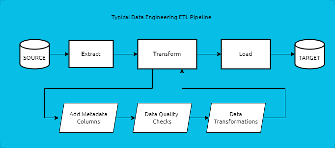

# Working with JSON

## JSON Overview

In addition to CSVs, JSON is another popular format for transporting data. This format is popular amongst web and mobile applications and it stand for JavaScript Object Annotation (JSON). JSON provides a very flexible structure for representing data. Another benefit of JSON is that it provides the means for having complex nested and hierarchal data structures. This is in contrast to CSVs where they only rigid and flat data columnar structures. 

Let's see an example a JSON object:


```json
{
    "name": "Freddie Mercury",
    "born": "Farrokh Bulsara",
    "nationality": "British",
    "occupation": "Singer, Song Writer",
    "age": 45
}
```

JSON objects are very similar to a Python `dict`. In this example, our JSON object contains the following keys: _name, born, nationality, occupation, and age_. Each key as its value followed by a semicolon. A field value could include ints, floats, strings, booleans, or other complex structures like lists or other JSON objects (dicts). There are a few exceptions to JSON objects and Python dicts:
- A JSON object can start as an array of other JSONs such as: `[{first_json}, {second_json}, ...]`
- JSON key names must always be enclosed in double quotes `"` and not single quotes `'`
- JSON None value is defined by the keyword `null` such as `{"name": null}`

While flexibility and the hierarchal nature of JSON are two of its main advantages, JSON files have some disadvantages:
- They are relatively large since each row includes both field names and their values. This can get very redundant and results in large file sizes; making it not very ideal for transporting very large data volumes.
- Because of their relatively large size and complexity, JSON files take longer execution time and more processing power to parse. They are typically amongst the slowest file types. Although modern Big Data platforms have improved their processing time via distributed algorithms.

This lesson will cover how to read/write json objects in Python.

## Reading JSON

Python provides a built-in **`json`** module to read/write JSON objects into Python `dict`. This module makes it extremely easy to convert back and forth from Python dicts and JSON objects.

Let's look at the following file as an example: [`data/freddie.json`](../data/freddie.json)

```json
{
    "name": "Freddie Mercury",
    "born": "Farrokh Bulsara",
    "birth_date": "5 September 1946",
    "nationality": "British",
    "occupation": "Singer, Song Writer",
    "age": 45,
    "status": "Legend",
    "biography": {
        "early_life": "Mercury was born Farrokh Bulsara in Stone Town in the British protectorate of Zanzibar.",
        "vocals": "Although Mercury's speaking voice naturally fell in the baritone range, he delivered most songs in the tenor range.",
        "song_writing": "Mercury wrote 10 of the 17 songs on Queen's Greatest Hits album: \"Bohemian Rhapsody\", \"Killer Queen\", ...",
        "relationships": "In the early 1970s, Mercury had a long-term relationship with Mary Austin. By 1985, he began another long-term relationship with Irish-born hairdresser Jim Hutton"
    },
    "tributes": [
        "Statue of Freddie Mercury overlooking Lake Geneva in Montreux, Switzerland",
        "Mercury statue above the West End's Dominion Theatre"
    ]
}
```

Pay special attention to the hierarchal nature of this JSON object:
- The _biography_ field is itself another JSON object containing keys and values (_early\_life, vocals, song\_writing, ..._)
- The _tributes_ field is a nested list of strings

<br/>

Now, let's look at the built-in `json` module in action to read this file:


```python
# import the built-in json module
import json

# open file for reading
with open("../data/freddie.json", "r") as json_file:
    # load the json into a dict
    freddie_dict = json.load(json_file)

    # example: access json felids
    #   simply access dict/json fields by key names
    print(freddie_dict["name"])

    # example: loop thru complex felids
    #   print tributes
    if "tributes" in freddie_dict:                  # check to see if key exists
        for tribute in freddie_dict["tributes"]:    # loop thru list
            print(tribute)
```

Let's dissect this code:
- The `json` module provides a `.load()` method to read the entire content of a JSON file.
- This method return a Python `dict` object. We can easily access the JSON fields via the dict keys. For example: `freddie["name"]` will access the name of Queen's legendary vocalist and song writer, Freddie Mercury.
- This method takes an open file handle for reading. We open the file using the familiar built-in `open()` method.
- Pay special attention that the `.load()` method expects the JSON file to contain a valid (and single) json record enclosed in brackets `{}`. This method raises an exception if there are any issues in the formatting of this file.

## Writing JSON

The `json.load()` method is accompanied by its reversed `json.dump()` method which writes a Python `dict` into a JSON file. This method takes two positional parameters. The first parameter is the Python dict to write into the file while the second parameter is the open file handle for writing. 

Let's see this method in action:


```python
import json

# let's write freddie's dict back to a file
print(freddie_dict)
# let's add a field
freddie_dict["to"] = "we love you eternally"

# open a file for writing
with open("../data/freddie_2.json", "w") as json_file:
    # write a dictionary as json
    #   pay attention: this line is printed in compressed format with no
    #   no line separators or indention
    json.dump(freddie_dict, json_file)


print("done!")
```

Analyzing the code above:
- We add a new key to our freddie dict
- We open a file for writing via the familiar `open()` method
- The `json.dump()` method write the content of our dict into a file
- By default, this method writes a compressed JSON format skipping indentation formatting and adding newlines

Open _data/freddie\_2.json_ file and inspect its content.

<br/>

It's important to note some **limitations** of the `json.dump()` method. This method expects the values of the dict fields to be _JSON Serializable_ which means that it can only write the following data types: `int`, `float`, `str`, `boolean`, `list`, and `dict`. Other more complex types such as `datetime` will raise an exception. Later we will see how to write our own JSON encoders to _serialize_ complex types (ie: format them into string).

To avoid this exception for now, we're going to add two optional parameters to our `.dump()` method:
- `skipkeys=True` tells the method to skip any complex fields and only serialize (write) simple ones
- `indent=4` formats the JSON output to be easier to read

Let's run the code again and compare the results:


```python
import json

# let's write freddie's dict back to a file

# let's add a field
freddie_dict["to"] = "we love you eternally"
print(freddie_dict)

# open a file for writing
with open("../data/freddie_2.json", "w") as json_file:
    # write a dictionary as json
    #   pay attention: this line is printed in compressed format with no
    #   no line separators or indention
    json.dump(freddie_dict, json_file, indent=4, skipkeys=True)

print("done!")
```

## Read/Write JSON Strings

In addition to reading and writing to files, the `json` modules provides two additional methods called `loads()` and `dumps()` that work with strings (instead of files). The `loads()` method loads JSON string into a `dict` while the `dumps()` method reversibly writes a `dict` into a string.

Let's examine these methods:


```python
import json

json_string = """
    {
        "name": "Freddie Mercury",
        "born": "Farrokh Bulsara",
        "nationality": "British",
        "occupation": "Singer, Song Writer",
        "age": 45
    }
"""

# read json string to dict
freddie = json.loads(json_string)
print(freddie)
print(type(freddie))

# write dict back to json string
freddie["genres"] = "Rock"
json_string = json.dumps(freddie)
print("json:", json_string)
```

#### Exercise

The the following dictionary to a json string then read the json string back into a `dict`:


```python

sir_elton = {
    "name": "Sir Elton Hercules John",
    "born": "Reginald Kenneth Dwight",
    "occupation": "Singer, pianist, composer",
    "instruments": "Vocals, piano, keyboards",
    "age": 75
}

# write the dict into a JSON string

# write the dict into a JSON **file** now

# read the JSON string back into dict

# read the json file into a dict

```

## Working with JSON Row Files

JSON Row is a special file format which each line of the file contains a separate JSON object. This file stores a large of number of _json rows_ as individual lines.

You can see an example of this in: `data/profiles_simple.json`

This file contains multiple lines. Each line contains a JSON object storing a user profile. To help visualize the JSON structure, copy/paste the first line into an online JSON formatter such as [jsonformatter.org](http://jsonformatter.org):

```json
{
   "uid":"h5jYqxqAHAQEhCx2rbuSZJ",
   "name":"Tara White",
   "gender":"F",
   "email":"tara.white@gmail.com",
   "birthdate":"1963-08-23",
   "salary":143720.55,
   "credit_score":511,
   "active":true
}
```

The familiar `json.loads()` method makes reading this file format very easy. We can:
- Open the file for reading
- Read the file content line by line
- And call the `json.loads()` method to covert the JSON object into dicts

Let's see this in action:


```python
import json

# hold all profiles
profiles = []

# open the file for reading
with open("../data/profiles_simple.json", "r") as json_file:
    line_num = 1
    for line in json_file:
        # read json string (the line) into a dict
        row = json.loads(line.strip())
        # print the dict
        print(f"{line_num:02d}: {row}")
        # incr. line number & append profiles
        line_num += 1
        profiles.append(row)

print(f"Read {len(profiles)} profiles")
```

### Checking Schema and Data Types

Since JSON objects are highly flexible and can have varying fields between different rows, it's common data engineering practice to always check their structure (schema) and data types upon ingestion. This will ensure that the JSON row contains all the required fields and decode any special types (like datetime) into their appropriate Python types.

The code below introduces two new functions for reading our profiles:
1. `check_schema()`: This method check the JSON row (dict) for a series of required keys. This function return False if any keys are missing. The list of keys to check are passed as a static set called `REQUIRED_SCHEMA_FIELDS`.
2. `parse_date()`: Parses the _birthdate_ field into a python datetime object using the `datetime.strptime()` method.

Let's see this action:


```python
import json
from datetime import datetime as dt

# hold all profiles
profiles = []


# set of required fields in the json schema
REQUIRED_SCHEMA_FIELDS = {'uid', 'name', 'email', 'birthdate'}

def check_schema(row, required_fields=REQUIRED_SCHEMA_FIELDS):
    """
    checks if a json row (or dict) contains all required fields (or keys)
    """
    # loop through all the required fields
    for field_name in required_fields:
        # return false if any key is not in the dict
        if field_name not in row:
            return False
    # otherwise return true
    return True


def parse_date(value, dtfmt="%Y-%m-%d"):
    """
    function to parse a date string into datetime.date object.
    return None if there are any issues
    """
    try:
        return dt.strptime(value, dtfmt).date()
    except:
        return None


# open the file for reading
with open("../data/profiles_simple.json", "r") as json_file:
    line_num = 1
    for line in json_file:
        # read json string (the line) into a dict
        row = json.loads(line.strip())
        # check json schema
        if not check_schema(row):
            # print error message if the row schema is incorrect
            msg = f"Invalid Row Schema (missing required fields): {row}"
            print(msg)
            # optionally we could raise an exception
            # raise ValueError(msg)
        else:
            # parse fields
            row["birthdate"] = parse_date(row["birthdate"])
            # print the dict
            print(f"{line_num:02d}: {row}")
            profiles.append(row)
        # incr. line number
        line_num += 1

print(f"Read {len(profiles)} profiles")
```

By running the code you can see that all _birthdate_ fields are now converted into python `datetime`. 

Try editing the file, remove some required fields, and run the block again.

#### Vehicles Exercise

- Read the JSON Row file `data/vehicles_simple.json`
- Convert each row into a `dict`
- Create a schema check function to validate the following fields are included in each row: _license\_plate, make\_model, year, registered\_date, and registered\_name_
- Create a method to convert the _registered\_date_ field into a `date` object
- Create another method to separates the _make\_model_ field into two individual _make_ and _model_ fields. Hint: these values are separated by a comma (,)


```python
# define schema check and transformation methods

# read vehicles_simple.json file row by row
#   apply your checks & transformations
#   print the rows

```

### Serializing Special Data Types via a Custom JSON Encoder

As mentioned above, the default `JSONEncoder` class used by the `dump()` and `dumps()` methods is **only** capable of _basic types:_  str, int, float, bool, None, list, dict. A `TypeError` is raised by these methods if we try to write any other data type such as datetime.

Try running the code below:


```python
from datetime import datetime, date

david_gilmour = {
    "name": "David Gimour",
    "birthdate": datetime(1946, 3, 6),
}

json_string = json.dumps(david_gilmour)
print(json_string)
```

In order to resolve this, we must provide our own json encoder class which is capable of serializing (converting to string) any special fields. We do this by inheriting the default `json.JSONEcoder` class and overriding its `default()` method. This method is used by `json.dump()` and `json.dumps()` methods to serialize json objects. 

The code below:
- Create a custom json encoder class called `SimpleJSONEncoder`
- This class inherits the default `JSONEncoder` and overrides its `default()` method
- The `default()` method check for `date` data types and converts them properly to a date string using `datetime.strftime()` method
- Any other data types is passed back to the default parent class encoder (JSONEncoder class) using the `super()` method
- We use our custom json encoder while calling the `dumps()` method by setting its `cls=` parameter


```python
from datetime import datetime, date
from json import JSONEncoder

class SimpleJSONEncoder(JSONEncoder):

    def default(self, value):
        # check if the field is a date object
        if isinstance(value, date):
            return datetime.strftime(value, "%Y-%m-%d")
        elif isinstance(value, datetime):
            return datetime.strftime(value, "%Y-%m-%d %H:%M:%S.%f")
        else:
            return super(SimpleJSONEncoder, self).default(value)


david_gilmour = {
    "name": "David Gimour",
    "birthdate": dt(1946, 3, 6),
}

# use our custom JSONEncoder
json_string = json.dumps(david_gilmour, cls=SimpleJSONEncoder)
print(json_string)
```

Stackoverflow is always a great place to search code snippets for special json encoders when needed 😉

#### Exercise

- Read the vehicle records that you parsed back into a JSON row formatted file
- Remember that you parsed your _registered\_date_ fields are python date objects
- You must create a custom json encoder to serialize these fields back into string
- Modify your encoder to also serialize int types as strings


```python
# create a custom json encoder to serialize date and int classes

# write your vehicle records into a json row file
# use your custom encoder
```

## Conclusion

Congratulations, you can now effectively work with JSON file formats. They are a very flexible and powerful method to transport data. Most modern databases such as MySQL and Google BigQuery provide special data types to store and query JSON fields. These databases provide special JSON functions to work with these fields. These fields are **very powerful** since they bring the _modern, complex, flexible, nested_ structure of JSON into the flat and rigid structure of database. 

Feel free to refer to [MySQL](https://dev.mysql.com/doc/refman/5.7/en/json-function-reference.html) and [Google BigQuery](https://cloud.google.com/bigquery/docs/reference/standard-sql/json_functions) documentation on their JSON support. Google BigQuery can also natively ingest data from a JSON Row formatted file; making it ideal to directly ingest data from web and mobile applications.

Further, most Non-SQL databases such as MongoDB, Google Firestore, and Google Firebase store rows directly in JSON format. This allows web and mobile applications (the primary users of these databases) to directly store their Javascript objects into databases. The flexible and nested structure of JSON enables applications to easily add/drop fields as new versions of applications role out without having to modify the database tables structure for existing rows. Remember that adding (or dropping) a field in SQL or Relational databases require us to modify the entire table definition possibly causing issues.

While JSON is a very commonly used data format amongst web and mobile application, an enhanced format called **parquet** is a very common in Cloud and Big Data applications. We will learn about this format later. For now, know that this format provides the flexibility of JSON while addressing its limitations on being large and slow to process. Parquet format is well supported by Pandas and Big Data platforms such as Google BigQuery and Spark.

<br/><br/>

# Real World Data Engineering Example

## ETL Overview

Throughout this lesson, we're going to build a near real world end-to-end _data engineering pipeline_. This lesson will build a multi-stage pipeline that reads, transforms, and writes a JSON row file.

The point of this lesson is to familiarize ourselves with common stages of a _Real World Data Pipeline_. A proper data engineering task typically includes the following stages:
1. **Extracting** or reading the data from the source
2. Adding **Metadata** columns and tags for organizational purposes
3. **Data Quality** checks to ensure ingesting clean data
4. Data **Transformations** to apply business logic and conform fields to their desired format
5. **Loading** the data into the target system (ie: database or the Cloud)

This process is typically known as **ETL** short for **E**xtract, **T**ransform, and **L**oad. In short, the term ETL is synonymous with Data Engineering. This is the most common task of a data engineer. **Remember** this term; it's used very often in the industry.



The example in this lesson will cover all the above task. 

<br/>

But before we move on, it's worth noting a few other common stages that are not covered in this lesson...

The following steps are commonly associated with _Data Science Pipelines_. A typical data science pipeline might also include the following stages before loading to the target system:
1. **Feature Extraction:** Refers to the extraction of key fields/columns (or known as statistical variables) that are specifically used by the machine learning model at hand
2. **ML Model Refresh**: Refers to calling the machine learning model algorithm and including its results into our data. A machine learning model typically either predicts an outcome or classify our data with some labels/categories. These are two most common machine learning tasks.

As _professional_ data engineers we might also include these steps:
1. **Metrics & Volumetrics**: Capturing metrics such as: _processing time, throughput (rows/sec or MBs/sec), load time, number of rows, number of erroneous rows, ..._
2. **Logging**: Capturing logs and console logs of our program for troubleshooting later if needed


## JSON Row User Profiles

The main purpose of this exercise is to develop a typical data engineering pipeline mimicking the stages explained above. To do this, we're going to build a pipeline that processes a JSON row file containing a series of user profiles. Each row of our file contains a nested JSON user profile. Some of the lines are intentionally tempered with to include errors. Our purpose is to read and transform the "OK" (good) rows while writing the error rows into a separate _reject_ file.

Let's start by examining our source file. Open the file: [`data/profiles_complex.json`](../data/profiles_complex.json)

Each row contains a nested user profile. To help us visualize the nested JSON structure, copy & paste the line into an online JSON formatter tool such as [jsonformatter.org](https://jsonformatter.org/):

```json
{
  "uid": "gP2VcwQwgc9oCBUPo7sK88",
  "name": "Sarah Turner",
  "gender": "F",
  "email": "sarah.turner@gmail.com",
  "birthdate": "1924-11-17",
  "address": "58469 Espinoza Crest Apt. 686\nNew Keithville, CA 65065",
  "geo_location": [
    "34.63915",
    "-120.45794"
  ],
  "credit_cards": [
    {
      "card_type": "Maestro",
      "card_number": "6503072302017585",
      "exp_date": "07/24",
      "cvc": "597"
    },
    {
      "card_type": "Maestro",
      "card_number": "379002902169035",
      "exp_date": "12/29",
      "cvc": "569"
    }
  ]
}
```

Looking at this JSON structure, we see that:
- Each user contains a series of standard fields such: _uid (user id), name, email, gender, ..._
- We also have a nested structure for _credit\_cards_ and _geo\_location_


### Error Rows

Take a closer look at the file content. Some of the rows contain invalid data. For example:

1. Line #15 and #28 contain _null_ (None) values for user ids (_uid_)
2. Line #10 is missing the _email_ field
3. A few of the lines like line #30 contain special military addresses

Our goal is be to read the file and separate the _"OK"_ records from the _"REJECTS"_.

### Data Pipeline

Now, we're going to create a data pipeline to read and transform this file. Our pipelines will include the following stages:

- **Stage #0:** Reading the file into JSON rows
- **Stage #1:** Adding metadata columns to help us keep things organized
- **Stage #2:** A series of data quality checks:
   - Schema Check: Check the row schema (structure) to ensure all required fields are present in each row
   - Null Check: Check the value of required fields to ensure they are not null or None
   - If a row fails to pass either check, it would be _rejected_
- **Stage #3:** A series of data transformation tasks:
   - Parse Addresses: Break down the address field into four fields: street address, city, state, zip
   - Any address non conforming to this standard structure will be _rejected_
   - Count the number of credit cards: Add a new field called num_cards which is the count of credit cards records per row
- **Stage #4:** Write the output
   - Write all _"OK"_ (conforming) rows into a separate file
   - Write all _rejected_ rows into another file with a brief message on why they were not conforming

<br/>

To help us visualize this, the following flowchart depicts the logic that we are going to implement:


<br/>

Without any further ado, let's get started...


### STAGE #0: Read JSON rows

In this stage, we will define a `run()` method to read our JSON file into python dicts using the built-in `json` module. We'll add some additional syntax to account for running into any exceptions. This will be done by using a `try/except` block. Our method will track of number rows processed and print a short line summary at the end.

A few things to note about our code:
1. We use the long form of `try/except` with an optional `finally` block. The `finally` block always runs at the end of either `try` or `except`. This will ensure that this block of code gets executed regardless if there was an exception or not.
2. We keep track of ok rows (`ok_count`), rejected rows (`reject_count`), and total number of rows (`line_num`) using the `try/except/finally` blocks.

Let's see this in action:


```python
# STAGES -------------------
#   0) read the file into json rows


import json


def run(file_name:str, print_lines:bool=False) -> None:
    """
    Reads user profiles from a JSON row formated file.

    Args:
        file_name (str): file path to read
        print_lines (bool): print lines to console
    """
    # keep track or row counts
    line_num = 1            # current line number
    ok_count = 0            # number of rows without errors
    reject_count = 0        # number of rows with errors
    # open and read the file and read line-by-line
    with open(file_name, "r") as json_file:
        for line in json_file:
            try:
                # read json line into a dict
                row = json.loads(line.strip())
                # print the line
                if print_lines:
                    print(f"[{line_num:02d}][OK]: {row}")
                # update line count
                ok_count += 1
            except Exception as err:
                # print error row
                print(f"[{line_num:02d}][ERR]: {str(err)}, [DATA]: {row}")
                reject_count += 1
            finally:
                # finally block executes regardless if there was an exception or not
                # update the line count here
                line_num += 1
    # print line count summary at the end
    print(f"Read {line_num - 1} rows")
    print(f"OK rows: {ok_count:02d}, Rejected rows: {reject_count:02d}")


# call our function to test
filepath = "../data/profiles_complex.json"
run(filepath, print_lines=True)
```

### STAGE #1: Adding Metadata

This is one of the most important stages of **any** data engineering pipeline. Adding metadata fields will help us keep track of data as it makes it through our pipeline. This is typically the very first step in any pipeline. There are some common metadata fields that are always added:

1. **`modified_timestamp`:** This is the exact timestamp (in UTC) when we processed this record. In a larger database table, this field will tell which rows are updated recently; making it possible to only query rows within a time range. It's very common that other downstream data pipelines need to access only recently updated rows (vs everything). For example, a downstream pipelines could be a data science workflow to update a machine learning model; or a business intelligence (BI) pipeline to update a report. Any downstream pipelines can query the database table for any rows where _modified\_timestamp_ is **greater** than their last execution time. This will ensure that they only process newly updated rows. This process is known as **CDC** short for _Change Data Capture_.

    It's worth that some engineers also include another _created\_timestamp_ field. This field corresponds to the initial row creation or insertion into the database vs. _modified\_timestamp_ is the last modification timestamp.

1. **`batch_id`:** This is a unique ID assign to each run of our script (or pipeline). This field links rows to a particular run of our script (with a large database table). Let's say that later on we find a bug in our script or think that somehow the script was compromised. This field will help us to exactly locate the affected rows within a larger database table. Perhaps, we like to delete these rows to reprocess later; we could simply issue a DELETE statement to our database with this batch ID.

2. **`tags`:** This is a commonly used field by well-seasoned senior data engineers. This is a nested key/value JSON or dict field. It allows us to store any additional metadata tags regarding this row. Some of the common use-cases are _Row Level Security (RLS)_. This example adds a couple of common _RLS_ fields such a _security\_level_ and _allowed\_users_. Let's say that we need to implement a mechanism to easily identify rows containing _Personal Private Information (PPI)_ and allow only certain user groups to query them. These tags will help us to exactly achieve this. We can scan our row for personal information can add the appropriate tags. In North America or European Union this is actually required by law. In this example since our records include name, email, and addresses we will tag everything with the highest level of security.

    It's worth mentioning that seasoned data engineers use this field to add more tags. Some common tags are: _processing\_status_, _source\_system_, _pipeline\_name_, etc...

<br/>

As you gain more experience, you will see that each company likes to define their own set of required _metadata fields_. These fields are also commonly called _ETL_ or _Control_ fields.

<br/>

Before we move on to the code, please make sure that you **remember** the keywords explained above:
- _Metadata_ or _ETL_ or _Control_ fields
- _CDC_ (Change Data Capture)
- _RLS_ (Row Level Security)
- _batch\_id_, _modified_ and _created_ timestamps

<br/>

Our `add_metadata()` method will add the following _Metadata_ or _Control_ fields to our rows:
- `modified_timestamp`
- `batch_id`
- `tags` with two RLS fields: `security_level` and `allowed_user_groups`

A few things to note about this code:
- Our code uses the pypi [`shortuuid`](https://pypi.org/project/shortuuid/) module to create a unique **UUID** (_Universally Unique ID_) for each run of the script. This module contains a method called `uuid()` which returns a unique code every time that is called.
- `tags` field is set as a nested key/value dict (or JSON column).


```python
# STAGES -------------------
#   0) read the file into json rows
#   1) add metadata columns


from datetime import datetime
import shortuuid

# get a unique ID for this ETL batch (script)
BATCH_ID = shortuuid.uuid()

def add_metadata(row:dict) -> None:
    """
    Adds ETL metadata columns to a row. Follwing metadata columns 
    are added:
        - modified_timestamp: current datetime
        - batch_id: unique ETL batch_id
        - tags: a key/value dict to store various data tags
        - tags.errors: a list of error message encountered while processing this row

    Args:
        row (dict): data row
    """
    global BATCH_ID
    now_utc = datetime.utcnow()
    # add timestamps for when we have processed this row
    row["modified_timestamp"] = now_utc
    # add the ETL (script) batch_id
    row["batch_id"] = BATCH_ID
    # a series of additional processing tags 
    row["tags"] = {
        # other tags can go here, for example:
        "security_level": "high",
        "allow_user_groups": ["admin",]
    }
```

Let's modify our `run()` function to call `add_metadata()` and run everything again:

> **NOTE:** In order to keep this notebooks slimmer and easier to scroll up/down, we have removed additional code comments here. It's good practice that you always comment your code.


```python

def run(file_name:str, print_lines:bool=False) -> None:
    """
    Reads user profiles from a JSON row formated file.

    Args:
        file_name (str): file path to read
        print_lines (bool): print lines to console
    """
    # keep track or row counts
    line_num = 0            # total number of rows
    ok_count = 0            # number of rows without errors
    reject_count = 0        # number of rows with errors

    with open(file_name, "r") as json_file:
        for line in json_file:
            try:
                row = json.loads(line.strip())
                # checks & transformations
                add_metadata(row)

                if print_lines:
                    print(f"[{line_num:02d}][OK]: {row}")
                ok_count += 1
            except Exception as err:
                print(f"[{line_num:02d}][ERR]: {str(err)}, [DATA]: {row}")
                reject_count += 1
            finally:
                line_num += 1
    # print line count summary at the end
    print(f"Read {line_num} rows")
    print(f"OK rows: {ok_count:02d}, Rejected rows: {reject_count:02d}")


# call our function to test
filepath = "../data/profiles_complex.json"
run(filepath, print_lines=True)
```

### STAGE #2: Data Quality Checks

As data engineers, it's our job to ensure only clean data enters the system; and that bad or incomplete data is sent back for reprocessing. It's very important that a series of checks are performed in the initial stages, ensuring downstream stages to work only with valid data. This is commonly known as **Data Quality** checks. Common Data Quality checks are:

- **Schema Validation:** This process ensures that the row contains all required fields. This is specially important when dealing with JSON rows since JSON's flexible format allows each row to contain different fields. The word **Schema** commonly refers to the field names and data types of the row. 

- **Data Type Validation:** As part of the Schema check or in a separate step, we also check the field values for correct data types (ie: int, float, string, string length, etc...).

- **Null Check:** Ensures that required fields do not contain _Null_ or _None_.

- **Referential Integrity Check:** This is a common process when a row references other entities (data tables) in our system (for example containing IDs of other tables such as _customer\_id_ or _product\_id_). You've learned that these are fields called _foreign keys_ which refer to _primary keys_ of other tables. It's important to ensure that we do in fact have a matching primary key in other tables. This process is done by performing a _join_ or a **lookup** to other tables. Our example here will NOT include this check but please be aware that this is a very common check.

<br/>

Before we move onto the code, it's important to **remember** some more keywords from this section:
- **Data Quality** the process of checking the quality of data prior to ingestion
- **Schema** referring to field names and data types.
- **Referential Integrity Check**, the process of checking the existence of foreign keys in their primary source

<br/>

Our example below will include the following _Data Quality_ methods:
1. `schema_check()`: ensure our row conforms to a required schema (including required fields).
2. `null_check()`: ensure fields contain valid values and not Nulls or Nones.

<br/>

**Note** a few additional comments regarding our code below:
- Any non-conforming rows will raise an exception which will be caught by the `except` block in the `run()` method and rejected properly.
- Both `schema_check()` and `null_check()` accept a default set of field names to check. This is done by using two _static_ variables called `REQUIRED_SCHEMA_FIELDS` and `NOT_NULL_FIELDS` in _ALL CAPS_.


```python
# STAGES -------------------
#   0) read the file into json rows
#   1) add metadata columns
#   2) Data Quality checks:
#       - schema check
#       - null check


# define a set of required fields (or keys)
#   static variable (all caps) used as the default value in `schema_check()` function
REQUIRED_SCHEMA_FIELDS = {'uid','name', 'email', 'birthdate', 'credit_cards', 'address', 'gender', 'geo_location', 'modified_timestamp', }

def schema_check(row:dict, fields=REQUIRED_SCHEMA_FIELDS) -> bool:
    """
    Checks if all required fields (dict) are present in a dict or JSON row. Any 
    missing fields will cause a KeyError exception.

    Args:
        row (dict): data row
        fields (set, optional): set of required required fields. Defaults to NOT_NULL_FIELDS.

    Returns:
        bool: True if all fields (keys) are present

    Raises:
        KeyError: if any of the required fields (keys) are missing in row
    """ 
    # loop thru the required fields and make sure they are all present
    for field in fields:
        # if this field is missing in row, raise an exception
        if field not in row:
            raise KeyError(f"Missing required field: {field}")
    # return true if no exceptions
    return True


# default fields to check for null values
NOT_NULL_FIELDS = {'uid','name', 'email', 'birthdate', }

def null_check(row:dict, fields=NOT_NULL_FIELDS) -> bool:
    """
    Checks the row to NOT contain None values for any of the fields provided. 
    Any fields containing None would cause a ValueError exception.

    Args:
        row (dict): data row
        fields (set, optional): list of dict keys to check the value for. Defaults to NOT_NULL_FIELDS.

    Returns:
        bool: True if none of the fields contain None values

    Raises:
        ValueError: if a field contains None
    """    
    for field in fields:
        # check to see if the value of this field is None or null
        if row[field] is None:
            # add an error message to this row
            raise ValueError(f"{field} can NOT be None or null.")
    # otherwise return True
    return True

```

Let's modify the `run()` method to call our **Data Quality** checks:


```python

def run(file_name:str, print_lines:bool=False) -> None:
    """
    Reads user profiles from a JSON row formated file.

    Args:
        file_name (str): file path to read
        print_lines (bool): print lines to console
    """
    # keep track or row counts
    line_num = 0            # total number of rows
    ok_count = 0            # number of rows without errors
    reject_count = 0        # number of rows with errors

    with open(file_name, "r") as json_file:
        for line in json_file:
            try:
                row = json.loads(line.strip())
                # checks & transformations
                add_metadata(row)
                schema_check(row)
                null_check(row)
                if print_lines:
                    print(f"[{line_num:02d}][OK]: {row}")
                ok_count += 1
            except Exception as err:
                print(f"[{line_num:02d}][ERR]: {str(err)}, [DATA]: {row}")
                reject_count += 1
            finally:
                line_num += 1
    # print line count summary at the end
    print(f"Read {line_num} rows")
    print(f"OK rows: {ok_count:02d}, Rejected rows: {reject_count:02d}")


# call our function to test
filepath = "../data/profiles_complex.json"
run(filepath, print_lines=False)
```

### STAGE #3: Data Transformations

At the end of the day, this is where we spent most of our time as data engineers. In our opinion this is also the most straight-forward and fun step. Data always needs to be transformed and refined before being used by downstream processes. Hence, the term for building a data _pipeline_ referring to the process of refining crude oil and transporting it from one location to another.

In our example below, we're going to introduce two transformation methods:
1. **`transform_address()`:** This method uses regular expressions (regex) to parse addresses from their standard US multi-line format into corresponding street address, city, state, zip fields. Regular Expressions are a very powerful technique to match string patterns. A brief introduction to regexes is included below. In this method, we use a rather complex regex to break down the address into 4 named groups: street_address, city, state, and zip. We use a regex technique called _Named Capturing Group_ with the syntax of `(?P<group_name>...regex pattern...)`. Pay attention to the four named groups below. Our regex looks for an address broken down into two lines with the first line including the street address, and the second line including the city, state zip separated by a comma a white space respectively.

    It's important to note, that our regex will fail to match military addresses. Military address do not include a comma between their city and zip portion, causing our regex pattern not to match. At the moment, these addresses will be rejected. This is a great feature request to improvement our regex to include these addresses (or to create a secondary pattern exclusively for military addresses).

2. **`add_num_cards()`:** This is relatively a very simple method which counts the number of credit cards present in the row and adds it to our _schema_.

#### Regular Expressions (regex)

**Regular Expressions** or **regex** are a very powerful language to match string patterns. They are commonly used to match patterns like phone numbers, emails, urls. For example a valid URL starts with either _http://_ or _https://_, contains _www_ or another sub-domain, a domain name, and ends with _.com_, _.edu_, or _.org_. This is a complex pattern which a Regex can extracts into the following portions: protocol (http or https), domain, sub-domain, and domain type (.com, .net, .edu, ...). Regexes are a far too complex of a topic to cover in this lesson; but we like you to understand their use-case and get familiar with their implementation in Python. Python provides a built-in module called `re` to exploit regular expressions.

[Real Python](https://realpython.com/regex-python/) provides an excellent tutorial of regex in Python. We also highly recommend the following tools:
- [Regex101](https://regex101.com/): A great tool for building and testing regex patterns online. This page includes a very handy regex _cheatsheet_. Even the most well-seasoned engineers need to use a cheatsheet to refresh their memory with regex syntax. This site export your patterns into code snippets in multiple languages such as Python or Javascript. Making it extremely easy to build, test, and copy/paste the code in your script.
- [Regex Golf](https://alf.nu/RegexGolf?world=regex&level=r00): A great online game for mastering regex patterns.

<br/>

Ok, let's get back to our transformations... Pay attention to the code below:
- We use a complex regex address pattern with _Named Capturing Groups_ to parse addresses
- Any address not conforming to our regex pattern will be rejected. At the moment, this will also include military addresses


```python
# STAGES -------------------
#   0) read the file into json rows
#   1) add metadata columns
#   2) Data Quality checks:
#       - schema check
#       - null check
#   5) transformatios:
#       - parse address into street_address, city, state, zip fields
#       - add a num_cards field

import re


def transform_address(row:dict) -> bool:
    """
    Parses the address into street_address, city, state, zip fields. Invalid addresses 
    cause a ValueError exception.

    Args:
        row (dict): data row

    Returns:
        bool: True if address is in valid US address format; otherwise False

    Raises:
        ValueError: Unknown address format.
    """
    # regular expression (regex) to match a US address composed of street_address, city, state, zip
    #   - this regex uses Named Capturing Group feature of regex to assign a name to a matching portion of the string
    #   - the syntax is (?<group_name>...) where ... contains the matching regex for this group
    address_regex = r"(?P<street_address>[a-zA-Z0-9 .]+)\n(?P<city>[a-zA-Z0-9 ]+), (?P<state>[A-Z]{2}) (?P<zip>[0-9]{5})"
    pattern = re.compile(address_regex)
    # match address using regex
    result = pattern.match(row["address"])
    if result:
        # if a possible match found. assign fields based on regex matching named groups
        row["street_address"] = result.group("street_address")
        row["city"] = result.group("city")
        row["state"] = result.group("state")
        row["zip"] = result.group("zip")
        # delete the original address field
        del row["address"]
        return True
    else:
        # if address is not a match, raise an exception
        address = row["address"].strip().replace('\n', ', ')        # remove ENTER from the address
        raise ValueError(f"Unknown address format: {address}")


def add_num_cards(row:dict) -> None:
    """
    Adds a field call num_cards with the total number of credit cards in this row.

    Args:
        row (dict): data row.
    """
    if "credit_cards" in row and isinstance(row["credit_cards"], list):
        row["num_cards"] = len(row["credit_cards"])
    else:
        row["num_cards"] = 0
```

Let's modify the `run()` method again for call our data transformation methods:


```python

def run(file_name:str, print_lines:bool=False) -> None:
    """
    Reads user profiles from a JSON row formated file.

    Args:
        file_name (str): file path to read
        print_lines (bool): print lines to console
    """
    # keep track or row counts
    line_num = 0            # total number of rows
    ok_count = 0            # number of rows without errors
    reject_count = 0        # number of rows with errors

    with open(file_name, "r") as json_file:
        for line in json_file:
            try:
                row = json.loads(line.strip())
                # checks & transformations
                add_metadata(row)
                schema_check(row)
                null_check(row)
                transform_address(row)
                add_num_cards(row)
                if print_lines:
                    print(f"[{line_num:02d}][OK]: {row}")
                ok_count += 1
            except Exception as err:
                print(f"[{line_num:02d}][ERR]: {str(err)}, [DATA]: {row}")
                reject_count += 1
            finally:
                line_num += 1
    # print line count summary at the end
    print(f"Read {line_num} rows")
    print(f"OK rows: {ok_count:02d}, Rejected rows: {reject_count:02d}")


# call our function to test
filepath = "../data/profiles_complex.json"
run(filepath, print_lines=False)
```

### STAGE #4: Final Preparation

By now, our rows are transformed into the correct structure and any bad rows are rejected. Let's modify our `run()` method to create two separate file to contain our _OK_ and _rejected_ rows. It's very common to insert the _OK_ records into a database table while sending back the rejected rows for reprocessing or a manual intervention.

Pay attention to the code below:
- We compose two new file names including the original name, a timestamp, and the postfix of either _ok_ or _rejected_. These file names are stored inside `ok_file_name` and `reject_file_name` variables.
- We open two file handle (objects) respectively with the names of `ok_file` and `reject_file`. Since these handles are _NOT_ opened using the `with` statement, we _must_ remember to close them at the end using their `.close()` methods.
- These files are written using `json.dump()` within the `try` and `except` blocks.
- The `except` block capture the exception raised during our processing as a variable called `err`. This error message is added to the row as a key called `row["error"]`. This will make it easy for anyone reprocessing the file to know why exactly the row was rejected.
- Since our JSON structure includes `datetime` timestamps, we need to provide a special `JSONEncoder` to format them into a datetime string. This is done by inheriting the default `JSONEncoder` class into a `DatetimeEncoder` class. This class overrides the `default()` method to specifically identify and format datetime fields. **Note** that the default `JSONEncoder` class can only encode `int`, `str`, `float`, `list`, and `dict` types. If we need to write any other data type, we need to provide our own encoder class.

<br/>

Ok, let's see this in action:


```python

from json import JSONEncoder


class DatetimeEncoder(JSONEncoder):
    """
    Custom JSON Encoder class to properly encode datetime fields. All other fields are encoded with 
    their default formatting. This class inherits the default json.JSONEncoder class.
    """

    def default(self, value):
        """Encodes values to JSON. Adds special formatting for datetime fields.

        Args:
            value (object): field to encode

        Returns:
            object: encoded json string
        """
        # check for datetime type
        if isinstance(value, datetime):
            # format the datetime string
            dtfmt = "%Y-%d-%m %H:%M:%S.%f %z"
            return datetime.strftime(value, dtfmt)
        # all other data types default to the JSONEncoder parent class formatting
        super(DatetimeEncoder, self).default(value)


def run(file_name:str, print_lines:bool=False) -> None:
    """
    Reads user profiles from a JSON row formated file.

    Args:
        file_name (str): file path to read
        print_lines (bool): print lines to console
    """
    # keep track or row counts
    line_num = 0            # total number of rows
    ok_count = 0            # number of rows without errors
    reject_count = 0        # number of rows with errors

    # prepare a ok & reject file
    # -------------------------------------
    # add a timestamp to files
    file_timestamp = datetime.utcnow().strftime("%Y%m%d")
    # get the file name without it's extension
    file_name_without_extension = file_name.rpartition('.')[0]      # from the right of the string, partition by '.' and take the first partition
    # create ok and reject file names inclusing the timestamp
    ok_file_name = f"{file_name_without_extension}_{file_timestamp}_ok.json"
    reject_file_name = f"{file_name_without_extension}_{file_timestamp}_reject.json"
    # open files for writing
    ok_file = open(ok_file_name, "w", encoding="utf-8")
    reject_file = open(reject_file_name, "w", encoding="utf-8")

    with open(file_name, "r") as json_file:
        for line in json_file:
            try:
                row = json.loads(line.strip())
                # checks & transformations
                add_metadata(row)
                schema_check(row)
                null_check(row)
                transform_address(row)
                add_num_cards(row)
                # write to ok file
                json.dump(row, ok_file, cls=DatetimeEncoder)     # write the json row
                ok_file.write("\n")         # write endline character

                if print_lines:
                    print(f"[{line_num:02d}][OK]: {row}")
                ok_count += 1
            except Exception as err:
                # add error and line number to the json row
                err_msg = f"[{line_num:02d}][ERR]: {str(err)}"
                row["error"] = err_msg
                # write the error line to reject file
                json.dump(row, reject_file, cls=DatetimeEncoder)
                reject_file.write('\n')
                print(err_msg, row)
                reject_count += 1
            finally:
                line_num += 1
    # print line count summary at the end
    print(f"Read {line_num} rows")
    print(f"OK rows: {ok_count:02d}, Rejected rows: {reject_count:02d}")
    # close files
    ok_file.close()
    reject_file.close()


# call our function to test
filepath = "../data/profiles_complex.json"
run(filepath, print_lines=False)
```

## Conclusion: Pulling it all together

Stitching all the stages above into a final comprehensive Python _module_ under: `src/process_profiles.py`

This module accepts two command line arguments using the built-in `sys.args` module. These are the two parameters into our `run()` method. The first argument reflects the file_name to process; while the second argument indicates to print the lines to console or not. This module calls our `run()` method passing these parameters. Examine the module code; once you're satisfied, execute via the terminal:

```bash
cd src/
python3.7 process_profiles.py "../data/profiles_complex.json" yes
```
