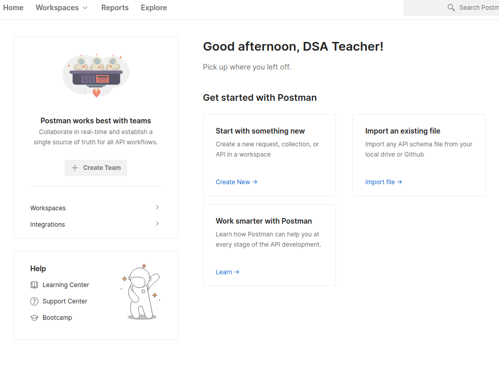
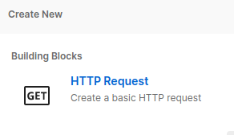
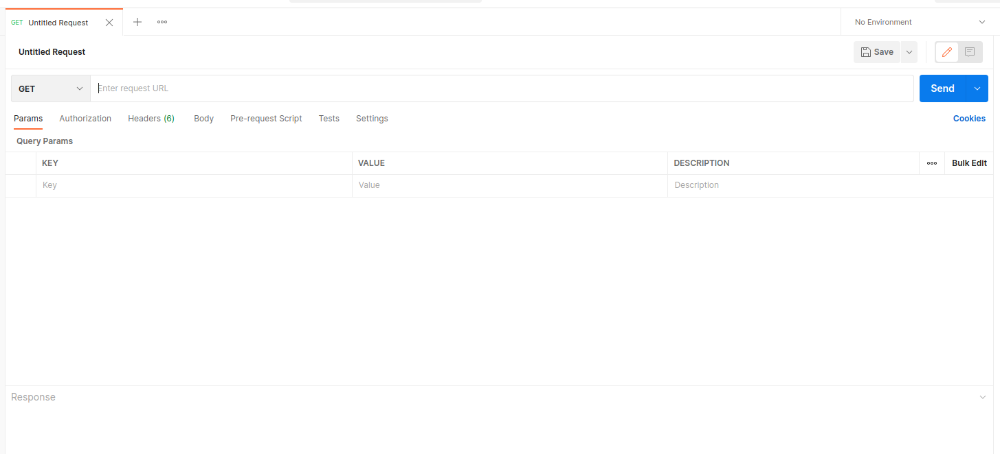
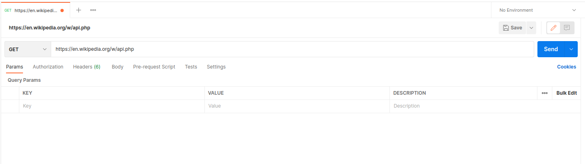
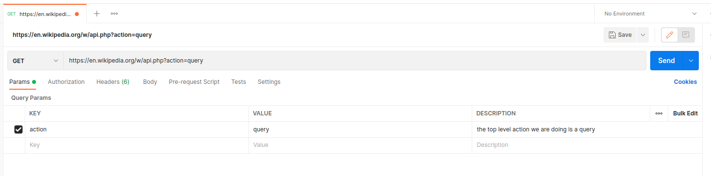
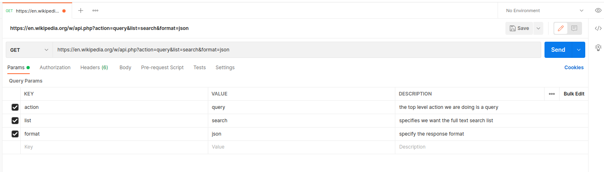
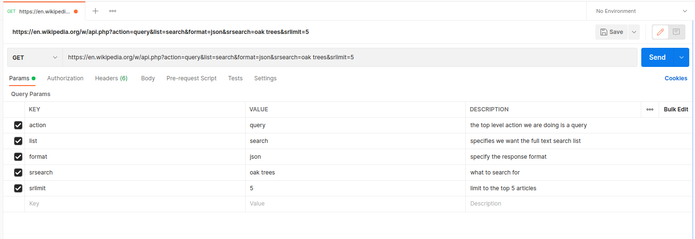
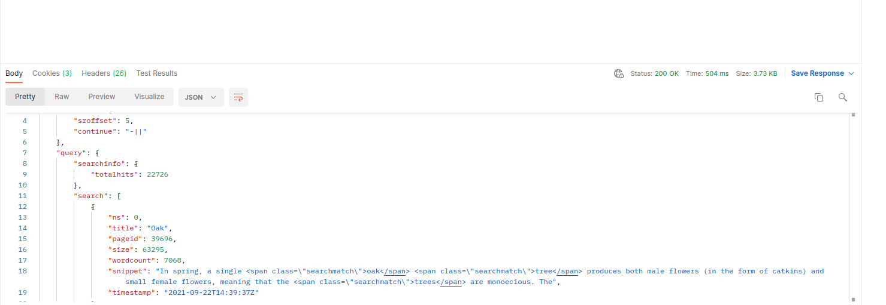
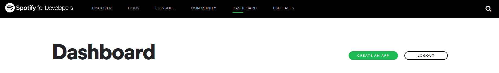
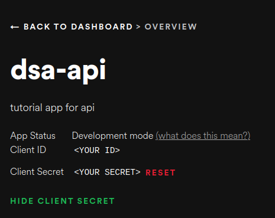

# APIs

In this chapter we will learn all about **A**pplication **P**rogramming **I**nterface or **API**s. They first question you probably wondering is:

## What is an API?

In the most basic sense, an API how an application talks to anything outside itself. We see it referenced in programming when we learn the methods of a library so that our application can interact with that library. That general definition covers a vast amount of uses cases but the most common type of API is a **HTTP** or a **REST** API. If you've ever browsed the web, you've used HTTP and REST is a very similar protocol so we can learn them together and henceforth, when we use API in the chapter, we're referring to an HTTP or REST API.

So how does an API work? We can also think about our web browsing example to get an overall idea of how they work before jumping into the specific components. Let's say you want to look up direction in Google Maps. To navigate to a page, you give your browser an address or URL that looks something like `https://google.com/maps`. This address consists of three parts:
- `https://` this is the protocol which describes the manner in which you're connecting. HTTPS is the secure form of HTTP but we can also see things like FTP here.
- `google.com` is the domain or host. This is the root address we're trying to access. Your browser uses DNS to convert this to an IP address to access. In this chapter, we'll often directly use local IP addresses like `0.0.0.0` or the alias `localhost` but this component tells us who we're asking for information.
- `/maps` tells us the path or endpoint we want to access. This tells Google what of their many services we're trying to access. `/maps` is a very broad endpoint that has a lot of functionality but we will be accessing and creating much more focused endpoints.

Let's look at another example to learn a few more components: `localhost:5050/fruit?color=red`

In this URL doesn't specify a protocol, so the default of resource we're contacting is expected. We have our host `localhost` and endpoint `/fruit` but we also have two new components:
- `:5050` this specifies the port we will communicate on. Different services talk on different ports by default, for example HTTP uses port 80 and HTTPS uses 443. We're choosing to talk on port 5050.
- `?color=red` this is a query parameter where we supply specific arguments to our API. 

These are the basic components to a URL but how do they actually get used to access an API? To access an API we use the URL to make a **Request**.

## Request

An API interaction always starts by a client (your code or browser) sending a **Request** to a remote service on a server (google, spotify, etc..). A _Request_ combines a URL with a HTTP or REST **method**. The _method_ tells the server about the type of interaction that we're going to make. There are two main methods we will use for almost all our API interactions **GET** and **POST**. As the name suggests, _GET_ corresponds to getting data from the server versus _POST_ is for posting data the server.

### GET

A GET request is the basic request for data from an endpoint. It is the default request made when you enter a URL into a browser. A GET request should the server side data, just request to be sent that data. If we want to send something _to_ an API, we use the POST method.

### POST

Any time you've filled out a form in a browser and clicked \*submit\* you've probably made a POST request. They have all the same parts as a GET request but with an additional request **body** containing the data we're POSTing. The API receives the information from the URL so it knows where and what do do with the the data it gets in the body.

### Others

There are [7 other HTTP methods](https://developer.mozilla.org/en-US/docs/Web/HTTP/Methods) such as _HEAD_ which is like a GET but they actual data isn't sent back, just the headers are (more on them soon!). In this tutorial, we will focus on the main two methods but it is important to know of the others so they can be used in the corner cases they cover.

## Headers

We just heard about headers in the context of what we get back from a request but what are they? **Headers** are a way to package additional information or _metadata_ into a _Request_ or the _Response_ we get back. Headers are a set of key/value pairs just like a dictionary. They consist of a name, followed by a `:` and then the value associated with that name. 

For example, if we make POST request, we might want to tell the API what format of data we're sending. To do this we'd use the `Content-Type` header. If we're sending an png image, we'd include the header `Content-Type: image/png` or if we were sending JSON we would include `Content-Type: application/json`. Headers are not case sensitive but [they follow standard conventions](https://developer.mozilla.org/en-US/docs/Web/HTTP/Headers) so that there is commonality across the internet and APIs.

Headers example:
```json
{
    "Content-Type": "image/png",
    "Authentication": "Bearer <%authentication-key%>"
}
```


## Response

Once we make a Request, whatever we get back from the server is our Response! These contain three parts:

- **Status code** this [standardized number](https://developer.mozilla.org/en-US/docs/Web/HTTP/Status) lets us know if our request worked or not, along with some information into why it worked or failed. For example, if you've ever gotten the **404** error when you make a typo in your browser address bar, you've seen a status code. The leading 4 tells us this is a client error (you made the mistake in typing) and the 04 means 'resource not found'. So this status tells us the browser couldn't find what we were looking for. Similarly, if we see a status code starting with 5, we know the error happened on the server side. This could still be our fault if we provided bad information to the server but at least we know it was received.
- **Headers** are exactly the same as our Request headers and carry additional information about the Response.
- **Body**: just like we could send a message body in our POST method, the Response method gives us data in its body. This can be a simple as a 'Hello' string or as complex as a huge chunk of bytes making up an image or a giant JSON string. 

And those are the basic parts that make up API Requests and Responses! As you can probably guess by their power and flexibility, there is a lot of additional nuance and detail but these basic pieces are sufficient to get us started and there are [amazing resources](https://developer.mozilla.org/en-US/docs/Web/HTTP) if you want to go deeper on any aspect. With all these basic pieces explained, let's take a look at how we actually *make* a Request using these pieces.

<br/>

## Postman Intro

One great tool for working with APIs is **Postman**. This tool is designed specifically to make requests which means is is prefect for both learning about requests and in the future, testing your API without having to make a full Python script. To get started with Postman, you will need to [make an account](https://www.postman.com/postman-account/) and either [download the program](https://www.postman.com/downloads/post) or use their web version.


## GET from Wikipedia

Now that we have an account, launch Postman and sign in. We're going to be making a GET request to the English Wikipedia API so first, let's navigate Postman to our request making screen. From the home screen, click **Start with something new**:



Then from the popup, select **HTTP Request**:



This will open a tab with a nice empty form ready to make a GET request:



Now that we have our form for making our request, let's learn a little about the Wikipedia API we're about to GET from.

### Wiki API

Before we can make a request we need to know two main things:
- What endpoint are using for our request?
- What parameters do we need to get what we want?

From [the Wikipedia documentation](https://www.mediawiki.org/wiki/API:Main_page#Quick_Start) we see that the English language Wikipedia endpoint is `https://en.wikipedia.org/w/api.php`. We enter this as the url following the GET in Postman:



This is the basic setup that will allow us to make requests from Wikipedia. Next we need to decide _what_ we're going to request. In our basic `localhost:5050/fruits?color=red` example, we were supplying the parameter `color` with value `red`. We need to learn what parameters Wikipedia is expecting and what values we can provide. Let's start with learning how to search Wikipedia as [documented here](https://www.mediawiki.org/wiki/API:Search). We note that the first thing we need to specify is the `action` parameters. Searching is a type of `query` so we add the following to our **Params** section:



Within `query`, we see that [the parameter `list` tells us what to get and full text search is specified with the value `search`](https://www.mediawiki.org/w/api.php?action=help&modules=query). While we're here, we will also specify the format of the response we want to receive as JSON with the `format` parameter:



With these top level params set, we can now actually perform our search. Let's set two search parameters, `srsearch` and `srlimit`. The first specifies the search string to use. Let's say we're amateur botanists and want to learn about oak trees. We can do this by setting `srsearch` to `'oak trees'`. Next, use use `srlimit` to limit our search to the top 5 responses so we aren't overwhelmed with trees. Our request form will now look like this:




With this completed, we're ready to **Send** our request by clicking the button in the upper right corner. We will see Wikipedia's response to our request below our form:




# GET requests

To start, let's import the module and then create variables with the same parameters we just used in Postman:


```python
import requests

wiki_url = "https://en.wikipedia.org/w/api.php"

search_string = "oak trees"

params = {
    "action": "query",
    "format": "json",
    "list": "search",
    "srsearch": search_string,
    "srlimit": 5
}
```

All those names and values look pretty familiar to us! Next we can use the `requests.get()` method that uses the endpoint URL and the `dict` of our parameters to make a GET request and return whatever it gets as a `Response` object. We can then use the `text` attribute of our Response to see the string we just received:


```python
wiki_response = requests.get(url=wiki_url, params=params)
wiki_response.text

```

One of the best parts of `get()` is the `params` argument that allows us to pass in a dict of the key-value pairs that are automatically formatted correctly into the requested URL, just like the Postman interface does for us. If we want to see what URL was used to make a request, we can check the `url` attribute of the `Response`:


```python
wiki_response.url
```

Now that we have Wikipedia's response as a Python `Response` object, let's take a look that what attributes and methods this class provides us to access and explore the data we just requested. We can start with the `json()` method which converts the raw request payload seen above as a `str` into a Python `dict`:


```python
# pretty print (pprint) function
from pprint import pprint


data = wiki_response.json()
pprint(data)
```

We can see the search data is stored in a list called  `search` inside the `query` field of our `data` dict. If we loop over that, we can see the article titles and their summary:


```python
for result in data['query']['search']:
    print(result['title'])
    print(result['snippet'])
```

In addition to the specific data we requested, we also get meta information in our `Response`, such as encoding:


```python
wiki_response.encoding
```

Or the status code:


```python
wiki_response.status_code
```

The status code can be particularly helpful as you can make a request, and then fork behavior based on the status of the `Response` you get back.

You can also access the headers returned in your `Response`:


```python

headers = dict(wiki_response.headers)
pprint(headers)
```

This brings us neatly back to supplying headers of our own when making a request. We didn't set any headers when making our request but doing so is just as easy as supplying `params`. Let's make a new set of params to learn about lathes, limiting the responses to the top one, then we make a similar `dict` for our headers. We can start with the most basic and set a `user-agent` specifying who we are. Let's make that request and then print the title and snippet summary of the top response:


```python
lathe_params = {
    "action": "query",
    "format": "json",
    "list": "search",
    "srsearch": 'lathe',
    "srlimit": 1
}
headers = {
    'user-agent': 'dsa-api/0.0.1'
}
lathe_response = requests.get(url=wiki_url, params=lathe_params, headers=headers)
if lathe_response.status_code == 200:
    top_result = lathe_response.json()['query']['search'][0]
    print(f"We found the article {top_result['title']} with summary:\n{top_result['snippet']}")
```

# POST request

In addition to GETting data with the `requests` library, we can also POST data. The method `requests.post()` will handle sending data to a POST endpoint. This will look very similar to the `get()` we made earlier but now we can send more data in our request. `post()` still needs a URL, which will specify the POST endpoint to send data to. For our testing, we can use `https://httpbin.org/post` a handy site that we can use to see how POSTing data works. We will also need to have a payload of data. As the [docs for `post()` tell us](https://docs.python-requests.org/en/latest/api/#requests.post), this can be supplied as the parameter `data` or `json`, depending on what sort of data we want to send. Let's make a quick testing `dict` called `data_dict` and see what happens when we POST it using `data` and `json`


```python
post_url = "https://httpbin.org/post"
data_dict = {
    "key1": "Value1",
    "key2": True,
    "key3": 2
}

post_response = requests.post(url=post_url, data=data_dict, headers=headers)
print(post_response.text)
```

We can see that when we supply a `dict` using the `data` parameter, it get posted as a `form` and the actual `data` field is an empty string. If we supply the same dict using `json`, it is instead encoded as a JSON string that is sent as `data`:


```python
post_response = requests.post(url=post_url, json=data_dict, headers=headers)
print(post_response.text)
```

If we encode our `dict` as JSON manually and use the `data` argument, then we see that the string is send at `data`:


```python
import json
post_response = requests.post(url=post_url, data=json.dumps(data_dict), headers=headers)
print(post_response.text)
```

This will be true of any string we supply as `data` in our `post()` call.

In addition to posting in-memory dicts or strings, we can also POST files. To do this, we unsurprisingly use the `files` argument. This argument takes a `dict` with file names as the keys and file-like objects (usually created by `open()` in Python) as the values. Let's post one of the images used in our README to our testing site and see the results:


```python
readme_img = "./imgs/new.png"
file_dict = {
    "new.png": open(readme_img, "rb")
}
post_response = requests.post(url=post_url, files=file_dict, headers=headers)
print(post_response.text[:200]) #truncate our string because our image is rather large
```

# Authentication

Now that we're comfortable GETting and POSTing using Python, let's revisit authentication. We will be doing this with Spotify's powerful API.

## Spotify
The first step is to [create a free Spotify account](https://www.spotify.com/us/signup/) if you do not already have one. Once you have an account, we need to enable it as a development account by going to the [dev homepage](https://developer.spotify.com/). Then select the **Dashboard** tab and click the **Create An App** button:



This will bring up a popup where we can name our app and give a quick description. Let's call it something like `dsa-api` and note it is for an API tutorial. Once we accept the terms, this takes us to the landing page where we can see the name, description and importantly, Client ID (blocked in screenshot), and Client Secret



We will use these credentials to access the Spotify API. Save your Client ID and Client Secret in a YAML file called `./config/spotify.yml` with the following format:

```yaml
id: <your client id>
secret: <you client secret>
```

>Note: by saving our credentials in a file instead of using them directly in the notebook, we avoid exposing sensitive information. 

<br/>

As noted in our Authentication section above, there are many different ways one can implement authentication for an API. For Spotify, we have a simple **2-step** process once we have created out Client ID and Secret:
1. POST request to `https://accounts.spotify.com/api/token` with out Client ID and Secret and receive a token.
1. Use this token for any other API calls by including it in the headers.

Let's do the first step now. We begin by importing our modules and loading out Client ID and Secret:


```python
import yaml
import requests
from pprint import pprint

# read the yaml configuration file
with open("./config/spotify.yml") as fb:
    spotify_creds = yaml.full_load(fb)

# print the configuration
pprint(spotify_creds)


```

We can now POST these to Spotify and get a response with an API access token. We need to supply our two pieces of identification along with the `"grant_type": "client_credentials"` as the `data` in our POST request. The response we get back will have our token in it, ready to use till supplied expiration time is up:


```python
auth_url = "https://accounts.spotify.com/api/token"
auth_data = {
    "grant_type": "client_credentials",
    "client_id": spotify_creds['id'],
    "client_secret": spotify_creds['secret']
}
auth_response = requests.post(url=auth_url, data=auth_data)
auth_response.json()
```


With our access token in hand, we note that the format for the header used by Spotify is: `Authorization: Bearer <access token>`. We can create this header along with specifying JSON data type and our user-agent by creating the following headers:


```python
spotify_token = auth_response.json()["access_token"]

spotify_header = {
    'user-agent': 'dsa-api/0.0.1',
    "Accept": "application/json",
    "Content-Type": "application/json",
    "Authorization": f"Bearer {spotify_token}"
}
```

With our headers defined, we can now make requests from Spotify's other APIs

## GET search
Let's use the [Spotify search endpoint](https://developer.spotify.com/documentation/web-api/reference/#category-search) to search for the versions of Beethoven's Fifth Symphony in Spotify. As always, the first and most important step is to read the search API documentation to see what parameters are needed to make this search. We see that they search API takes the following parameters:
- `q`: the query string. We will use `'fifth symphony'`
- `type`: the type of thing we're searching for. In our case we want `'tracks'`
- `market`: what location to search within as Spotify is an international company with different media available in different markets. We will use `'US'`
- `limit`: how many results to return. We will set ours to `5`

If all goes according to plan, we can make a GET request with these headers and parameters and get at **200** status code and a JSON response of track objects:


```python

# prepare the search parameters
spotify_search = "https://api.spotify.com/v1/search"
spotify_params = {
    "q": "fifth symphony",
    "type": "track",
    "market": "US",
    "limit": 5
} 

# make the API call
spotify_response = requests.get(
    url=spotify_search, 
    params=spotify_params, 
    headers=spotify_header
    )

# print the response
print(f"status code: {spotify_response.status_code}")
pprint(spotify_response.json())
```

We can also search for Artists instead of tracks. Let's search for Duke Ellington and then use his unique ID along with another Spotify API.

## GET top tracks by an artist

The first step is a search just like we did before but now the `type` is `'artist'` and we can `limit` to a single result and make another request on the Spotify search API. From the JSON body of the response, we can then extract his unique ID:


```python
spotify_params = {
    "q": "Duke Ellington",
    "type": "artist",
    "market": "US",
    "limit": 1
}
duke_response = requests.get(
    url=spotify_search, 
    params=spotify_params, 
    headers=spotify_header
    )

# go through the json response as a dict
duke_dict = duke_response.json()["artists"]["items"][0]
duke_id = duke_dict["id"]

# print results to see
pprint(duke_dict)
```

With this ID, we can now look at [Spotify's Top Tracks API](https://developer.spotify.com/documentation/web-api/reference/#endpoint-get-an-artists-top-tracks). We note that the artist ID we extracted is part of the URL we will use to make our request. The required format is : `https://api.spotify.com/v1/artists/<ARTISt_ID>/top-tracks`. We can quickly construct this endpoint with Python string formatting. We then note that the only parameter we need to supply is `market` which we will keep as US. This means we are now ready to make the following request:


```python
duke_url = f"https://api.spotify.com/v1/artists/{duke_id}/top-tracks"

duke_params = {
    "market": "US"
}
duke_tracks = requests.get(url=duke_url, params=duke_params, headers=spotify_header)
duke_tracks.json()
```

Spotify's style of header-based authorization token is common but far from the only way authorization is handled. Just like the endpoints and parameters, reading an API's authentication documentation is always necessary before accessing it to make sure you use the correct format.

## Exercise

Register for an API Key on [API Ninjas](https://api-ninjas.com/). This site is full of great APIs to use. Using their [API documentation](https://api-ninjas.com/api), pick a few APIs and try them. We recommend exploring the following APIs:

- [Weather](https://api-ninjas.com/api/weather)
- [Cats](https://api-ninjas.com/api/cats) or [Dogs](https://api-ninjas.com/api/dogs) or [Cars](https://api-ninjas.com/api/cars)
- [Geocoding](https://api-ninjas.com/api/geocoding): converting a city (or location) into Lat/Lon

**NOTE:** API Ninjas provides python code snippets in their documentation. Try writing the code yourself and do NOT use these snippets.

