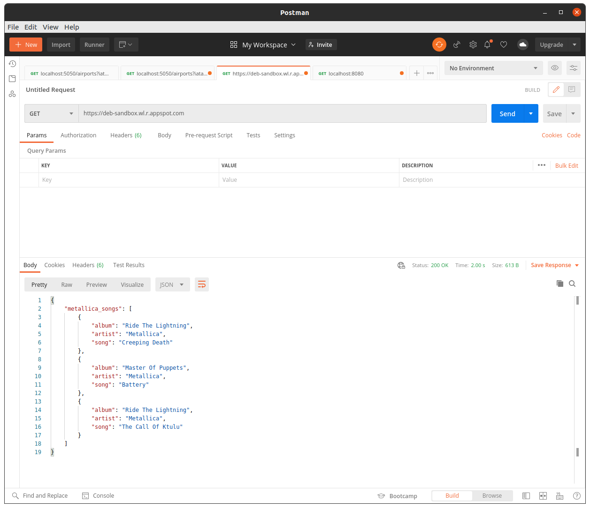
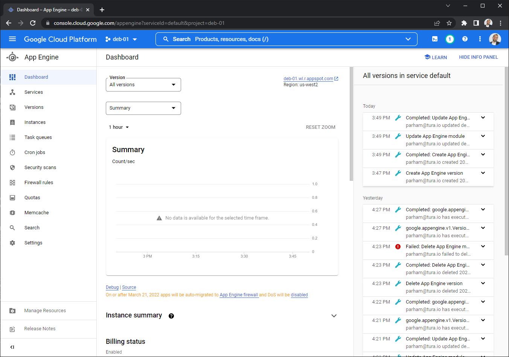
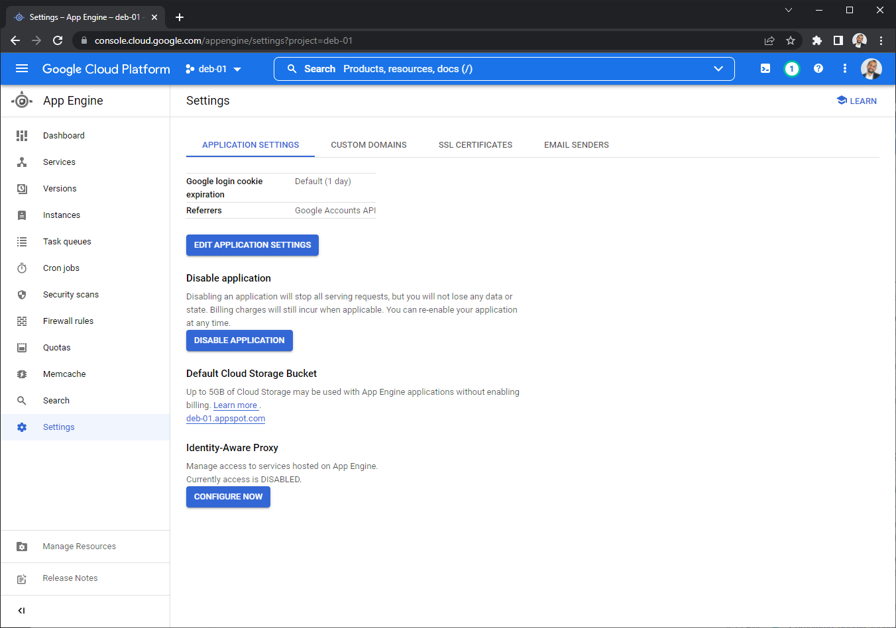
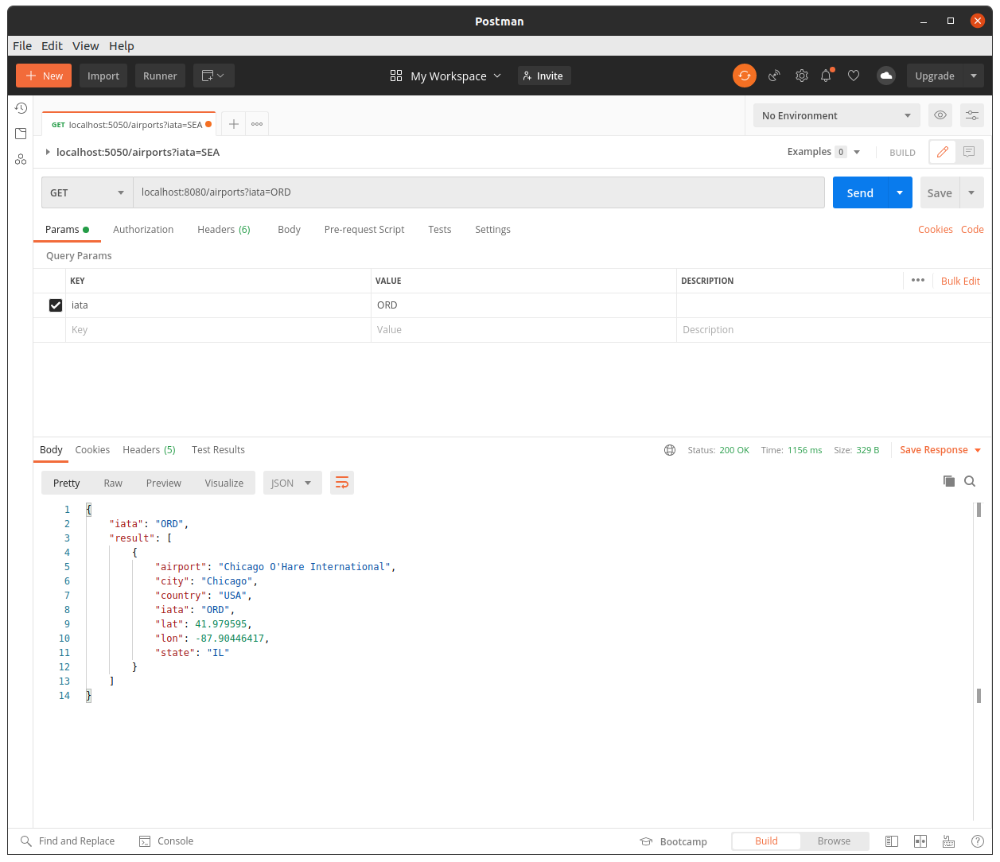
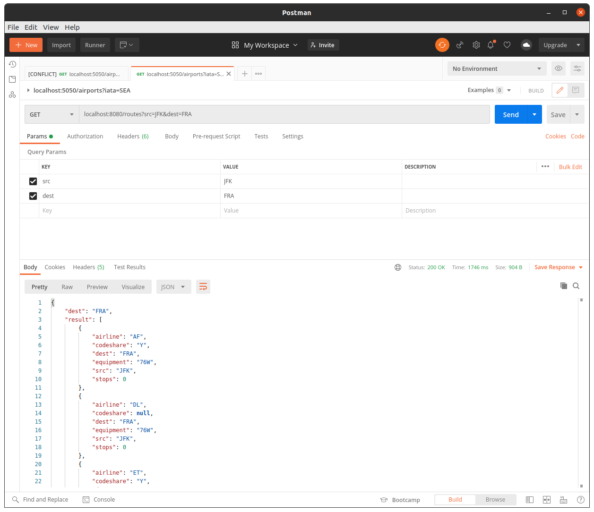
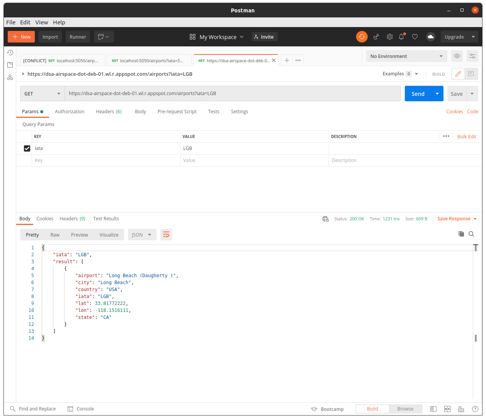

# Developing APIs on Google Cloud AppEngine

In this lesson you'll learn how to push flask app APIs to Google Cloud. By publishing your APIs on GCP, they become available to access from anywhere. The Google Cloud service capable of publishing Flask apps is called **Google Cloud AppEngine**. You'll see that with only a few commands you can host a flask application directory to App Engine.

Let's see this first hand...

## Publishing Flask Apps to AppEngine

To start, let's create a simple Flask app. Open the code in [`python/ex1/`](python/ex1/)

We'll start by creating a simple Flask app that returns a list of **Metallica** songs!

```python

from flask import Flask
import pandas as pd

app = Flask(__name__)


@app.route("/")
def index():
    # a few favorite metallica songs dataframe!
    df = pd.DataFrame([
        {"artist": "Metallica", "song": "Creeping Death", "album": "Ride The Lightning"},
        {"artist": "Metallica", "song": "Battery", "album": "Master Of Puppets"},
        {"artist": "Metallica", "song": "Fade To Black", "album": "Ride The Lightning"},
        {"artist": "Metallica", "song": "Orion", "album": "Master Of Puppets"},
    ])
    # convert the songs into a json dict and respond
    return {
        "metallica_songs": df.to_dict(orient='records')
    }, 200, {"content-type": "application-json"}


if __name__ == '__main__':
    app.run('0.0.0.0', 8080)

```

This is a fairly simple Flask app with a single index route which returns a list of Metallica songs. This app:
- Initializes a pandas DataFrame to hold a list of songs
- Converts them to a list of JSON dicts using the `.to_dict()` method with `orients='records'`
- Notice that we intentionally hosted our app on port `8080`. This is the default AppEngine port. We'll see this later.

</br>

Before we deploy our app, let's go over a few important files in this folder...
<br/>

### `requirements.txt`

You are already familiar with this file. This file holds the list of python pip packages used in our application. AppEngine is **smart enough** to recognize this file automatically pip install these packages on our Cloud AppEngine instances (the servers which will end up hosting this app).

```text
pandas==1.3.5
Flask==2.1.2
```

Always be sure to include the specific pip packages that you require here before deploying your apps.

We particularly used pandas DataFrames to demonstrate using an externally pip installed packaged in our code.

<br/>

### `.gcloudignore`

This file acts very similarly to a `.gitignore` file. AppEngine Flask apps are deployed by uploading the content of our directory to the Cloud. Later, you will use the `gcloud` command line to do this. This file allows us to tell AppEngine to ignore uploading unwanted files such as virtualenv, data files, credentials, or other cached files. Similar to `.gitignore` the patterns included in this file are omitted from the AppEngine.

Be sure to always include this file. You can use our file here as a template. This file is set to ignore most python and Flask cached files.

<br/>

### `app.yaml`

This is the **most** important file when deploying to AppEngine and it contains our AppEngine configuration. This file tells AppEngine how to deploy and manage our app on the Cloud.

Let's inspect its content:

```yaml

runtime: python37
service: default
instance_class: B1
basic_scaling:
  max_instances: 1
  idle_timeout: 5m

```

There are some important information here:
- The very first line sets the python runtime version for our app.
- `service` tag sets the name of our AppEngine service (_or application_). The very first service deployed onto a project must be called _"default"_; but any subsequent services can be called whatever we wish for. Aside from the _default_ service, other service names are used as part of public URL to access our API. You'll see later that AppEngine automatically assigns a public URL to our APIs.
- `instance_class` tag tells AppEngine what class of servers we like to host our app on. The _B1_ class listed here is the smallest and least expensive server class. Other classes provide more CPU and memory better suited for larger applications and cost more money. We can safely use the _B1_ class while we're learning and developing.
- The `basic_scaling` tag is the most important tag here. This tells AppEngine how to scale our application if it starts to get too many API requests. Here, we limit the server to only `1` instance and tell it to sleep after `5m` (minutes) of inactivity. This will stop the instance from incurring charges.

**NOTE**: Be sure to **ALWAYS** include this same exact `basic_scaling` configuration until you completely grasp _other_ scaling options. Other scaling options cab quickly rack up Cloud **charges**; and can **NOT** easily be turned off.

<br/>

We can always refer to [`app.yaml` documentation](https://cloud.google.com/appengine/docs/standard/python3/config/appref) page for the complete list of parameters set by this file.

<br/>

### Deploying our App

The familiar `gcloud` command line utility is used to deploy apps to AppEngine. `gcloud` makes this extremely easy!

Before deploying our first app, we must enable the AppEngine Cloud service on our project and set it operate within one of the Google data center regions. To do this run:

```bash
gcloud app create
```

When **prompted** choose the geographic region close to you. For simplicity and integration with other GCloud services in this curriculum we recommend choosing `us-central1`. 

This command enables AppEngine on our project. 

Deploying our app to the Cloud as easy as easy running a single command! From within the _python/ex1_ folder where our `main.py` and `app.yaml` files reside, run:

```bash
gcloud app deploy
```

This command takes a few minutes to run. If everything goes smoothly, we see a message with a URL where we can access our API:

```text
gcloud app deploy


Services to deploy:

descriptor:                  [/home/warthog/work/data-engineering-bootcamp/deb/ch4/ep4/python/ex2/app.yaml]
source:                      [/home/warthog/work/data-engineering-bootcamp/deb/ch4/ep4/python/ex2]
target project:              [deb-sandbox]
target service:              [default]
target version:              [20220519t190446]
target url:                  [https://deb-sandbox.wl.r.appspot.com]
target service account:      [App Engine default service account]


Do you want to continue (Y/n)?  

Beginning deployment of service [default]...
╔════════════════════════════════════════════════════════════╗
╠═ Uploading 2 files to Google Cloud Storage                ═╣
╚════════════════════════════════════════════════════════════╝
File upload done.
Updating service [default]...done.                                                                                                                    
Setting traffic split for service [default]...done.                                                                                                   
Deployed service [default] to [https://deb-sandbox.wl.r.appspot.com]

You can stream logs from the command line by running:
  $ gcloud app logs tail -s default

To view your application in the web browser run:
  $ gcloud app browse

```

In this example, you can see that our app is deployed to _`https://deb-sandbox.wl.r.appspot.com`_. This URL is different based on your project name and the **service** name in app.yaml. Since this is our _"default"_ service, nothing is appended to our project URL. Other services will have their name added to the URL. 

We can now use curl or Postman to publicly call our API. Just change the URL to match your AppEngine deploy message:

```bash
curl -X GET "https://deb-sandbox.wl.r.appspot.com"
```



**Congratulations**, you know have your own very first publicly deployed API; and what a better API other than 80s heavy metal rock songs?!! 🤘

<br/>

### AppEngine Deployment Hierarchy 

Google AppEngine apps are deployed in the following hierarchy:

```text
Services
  └── Versions
        └── Instances
```

- Each AppEngine **Service** (including the _default_ service) has multiple **Versions** and each version has multiple **Instances** (servers) that host that particular version.
- A _service_ is the set of API routes deployed by our code. The name of the service is determined by the `app.yaml` file upon deploying to AppEngine.
- Each time that we deploy our app (using `gcloud app deploy`) a **new** version of the app is deployed to AppEngine. AppEngine automatically assigns a new version number and routes all new API calls to our service to this latest version. Please **note** that previous versions of our API are still kept alive but receive no incoming connections! Of course, this behavior can be changed but this is particularly helpful if we wish to simultaneously support multiple versions of our APIs. Later you will see how to turn off previously deployed versions. 
- Each version has a number of (docker) **instances** which host your APIs. These are the compute engine servers that host our API. The scaling option in our `app.yaml` file directly controls the number  and type of servers launched.

To see a list of active services, version, and instances you can run:

```bash
# list all services
gcloud app services list

# list all versions
gcloud app versions list

# list all instances
gcloud app instances list
```

**NOTE:** When setting the `basic_scaling` with an `idle_timeout` option, listing instances may NOT show any running instances after the idle timeout has been reached. This is good! This means that google will not charge us if our APIs become inactive. AppEngine automatically starts up new instances if we start getting new API calls again.

<br>

### AppEngine Cloud Console

You can navigate through the services and version on the [AppEngine Cloud Console](https://console.cloud.google.com/appengine)



**Explore** the console:
- Go through the services and versions tab
- See the instances hosting hosting our app
- See how net traffic is split between different versions of our app

<br>

**Take** a moment exploring the console and getting familiar with the UI.

<br>

> **NOTE:** You can always **disable** AppEngine Service completely on your project on the [AppEngine Settings tab](https://console.cloud.google.com/appengine/settings). This will stop all AppEngine services and versions and will stop them from incurring cost on your project.
> 

<br>

## Stopping and Deleting Services and Versions

Since AppEngine instances take compute resources they incur Cloud cost as long as they are kept running. You should always remember to stop and delete your service when you are in development mode.

**NOTE:** you can **NOT** delete your default service (or version) but you can **stop** it.

To stop a particular version run:

```bash
# list your versions
gcloud app versions list

SERVICE  VERSION.ID       TRAFFIC_SPLIT  LAST_DEPLOYED              SERVING_STATUS
default  20220519t190446  1.00           2022-05-19T19:06:00-07:00  SERVING

# NOTE the VERSION ID above. In our example this is called 20220519t190446

# stop using the VERSION ID
gcloud app versions stop 20220519t190446

# test to see if you have any running instances left:
gcloud app instances list

Listed 0 items.

# CONTINUE listing versions and stopping (or deleting) them until you have no more running instances left.
```

Be sure to match your own _VERSION ID_ number.

**NOTE:**
- You can delete any service or instance other than the last running version of your _default_ service.
- BUT you can **stop** the last running version of your _default_ service ONLY if you have used `basic_scaling` or `manual_scaling` in _app.yaml_.
- If you happened to forget this setting, AppEngine uses `auto_scaling` by default which makes it **impossible** to stop the service. You must completely disable AppEngine or delete your project to stop incurring charges. The other option is deploy a new version of your _default_ service and reset the scaling option back to `basic_scaling`; then stopping all versions of your app. Our simple Metallica app shown here can be best used for this purpose since it sets _basic scaling_ for the _default_ service.
- You will not incur any charges as long as the `gcloud app instances list` command doesn't show any running instances. Be at ease, the **_B1_** instance used by this example is nearly **free**!

<br/>

### Exercise

Create new app directory and develop a simple `Hello World` Flask app:

1. Add a simple index route to your Flask App
2. Return _anything_ you like!
3. Create a `.gcloudignore` and `requirements.txt` file for you app
4. Populate an `app.yaml` with your service configurations. You have two options here:
   1. Deploy your app with a different service name
   2. Or re-deploy using the _default_ service name which will overwrite your (amazing) Metallica app!
5. Deploy your app to AppEngine and test it using Postman
6. Do **NOT** forget to stop (or delete) the version that you just deployed

<br/>

**NOTE**: practice **stopping** (or deleting) your apps after you are done developing them. You will **run out** of your Cloud credit if you forget to do this!

<br/>

```python

# create a new dir

# develop a main.py flask app

# initialize a requirements.txt and .gcloudignore file

# create an app.yaml config file

```

<br/><br/>

## Airspace API Using BigQuery

In this part of the lesson, we're going to expand on our knowledge by developing a set of API routes to query our _airspace_ tables from BigQuery. We'll be developing two flask routes to query our _airports_ and _routes_ tables. These routes will allow users to query _airports_ by _iata_ codes or search airline  _routes_ between _source_ and _destination_ airports.

<br/>

Follow the code for this section in **[`python/ex2/main.py`](python/ex2/main.py)**

<br/>

### Developing our App

Let's start by setting up the skeleton:
- Set up python logging
- Load our bigquery configuration params
- Build a new Flask app
- And initiate a client to interact with bigquery datasets

```python

import sys
import yaml
import logging
from google.cloud import bigquery as bq
from flask import Flask, request


# setup logging and logger
logging.basicConfig(format='[%(levelname)-5s][%(asctime)s][%(module)s:%(lineno)04d] : %(message)s',
                    level=logging.INFO,
                    stream=sys.stderr)
logger: logging.Logger = logging


def load_config(path_to_yaml):
    """
    Function to parse args out of a yaml file
    """
    with open(path_to_yaml) as open_yaml:
        return yaml.full_load(open_yaml)


# load configuration
conf = load_config("config.yml")
logger.info(f"starting flask app")

# create flask app and BigQuery client
app = Flask(__name__)

# get bigquery configuration and create a bq client
project = conf['project']
dataset = conf['dataset']
logger.info(f"BiGquery Config: project='{project}', dataset='{dataset}'")
logger.info(f"Creating BigQuery client")
client = bq.Client(project=project)


# index route
@app.route("/")
def hello():
    return "DSA Airspace BigQuery API", 200

```

This code should be fairly familiar to us:
- Python logging is setup and aliased as `logger` for ease of use within the app
- We define a method, called `load_config()`, to load basic BigQuery configuration parameters such as _project name_ and _dataset name_ from the `config.yml` config file
- We initialize our Flask app and BigQuery client. BigQuery is instantiated with the configuration parameters within our `config.yml`. This is **important** since it will make it easy for us to switch the BigQuery project or dataset in the future without changing any code.

> **NOTE:** We do **not** define a service account for the **`credentials`** associated with our Client. This will **default** our client to using the service account credentials set by the `$GOOGLE_APPLICATION_CREDENTIALS` environment variable. AppEngine automatically sets this variable to a _default_ service account **OR** the **_service\_account_** tag in our `app.yaml`.

**Remember this!**

<br/>

Now let's define our route to query _airports_:

```python

# getting airports by iata code route
@app.route('/airports', methods=["GET"])
def airport():
    """Query airports by iata code"""
    # variables from the global scope including the bq client
    global client, conf, dataset, project
    # get airports table name
    table_name = conf["airports_table"]
    full_table_name = f"{project}.{dataset}.{table_name}"

    # get the iata GET param
    iata = request.args.get('iata', default=None)

    if iata is not None:
        # search for specific iata airport code
        # create a parametrized query
        logger.info(f"query {table_name} for iata: {iata}")

        query = f"""
            SELECT iata, airport, city, state, country, lat, lon 
            FROM `{full_table_name}` 
            WHERE 
                iata = @iata
            """
        logger.debug(f"query:\n {query}\n")

        # create a bq job config to provide the iata param
        job_config = bq.QueryJobConfig(
            query_parameters=[
                bq.ScalarQueryParameter("iata", "STRING", iata),
            ]
        )
        # run the query
        result = client.query(query, job_config)

        # bq returns a list of dict rows as the result >> each row is a list item and each dict row contains column key/value pairs
        #   convert this using list/dict comprehensions
        #   data will again be a list of dicts
        data = [{k: v for k, v in row.items()} for row in result]

        # alternatively: we could also get the results by using the .to_dataframe()
        # df = result.to_dataframe()
        # data = df.to_dict(orient="records")

        return {
            "iata": iata,
            "result": data,
        }, 200, {"content-type": "application/json"}
    else:
        # no iata code provided, return all airports
        logger.info(f"query all {table_name}")
        query = f"""
            SELECT iata, airport, city, state, country, lat, lon 
            FROM `{full_table_name}` 
            WHERE 
                iata = @iata
            ORDER BY iata
            """
        logger.debug(f"query:\n {query}\n")
        
        result = client.query(query)
        data = [{k: v for k, v in row.items()} for row in result]
        return {
            "iata": iata,
            "result": data,
        }, 200, {"content-type": "application/json"}

```

**NOTE:**
- The BigQuery client and our config parameters are retrieved from the `global` scope _(defined above in the main body of our code)_
- The BiQuery table name is referenced by its fully qualified name: `project.dataset.table`
- We define our SQL `query` using a triple quote `"""` f-string. This allows us to elegantly format our SQL query into multiple lines and to include single quotes `"` if needed. 
- We log our SQL _query_ using **`logger.debug()`** level method. This is helpful when we're trying to debug our code and eliminates additional logging to the console if we're in production mode and only interested in _warnings_ or _info_ level logs.
- Our SQL _query_ includes a **parameterized** variable called `@iata`. This is how we pass the (_user provided_) GET iata parameter to our SQL query. The iata parameter is passed by using the bigquery `QueryJobConfig` and a `ScalarQueryParameter`. It's **best practice** to always use **parameterized queries** for things that our provided by the user.
- There's a bit of magic constructing our result `data` object from the query result-set. We use a combination of list and dict **comprehensions** to convert our bigquery result-set into a list of dictionaries. The result is a _list_ that contains our query rows. Each row is a _dict_ constructed with our column names as keys and their values.
- Finally, we `return` a JSON dict response back to our client and set the HTTP _status code_ and _headers_.


Take a **moment** to fully comprehend this code.

<br/>

Now, let's add our second route to query airline _routes_ between two airports:

```python

# query airline routes between two airports
@app.route(('/routes'))
def get_route():
    """
    GET route that returns airline routes based on source and destination
    """
    # variables from the global scope including the bq client
    global client, conf, dataset, project
    # get airports table name
    table_name = conf["routes_table"]
    full_table_name = f"{project}.{dataset}.{table_name}"

    # get src and dest from the GET params
    src = request.args.get("src", default=None)
    dest = request.args.get("dest", default=None)
    
    # check to see if we got both src and dest
    if (src is not None) and (dest is not None):
        logger.info(f"query {table_name} for src: {src} and dest: {dest}")

        query = f"""
            SELECT airline, src, dest, codeshare, stops, equipment
            FROM {full_table_name}
            WHERE
                src = @src
                AND
                dest = @dest
            ORDER BY airline, src, dest
        """
        logger.debug(f"query:\n {query}\n")

        # pass the SQL query params
        jc = bq.QueryJobConfig(
            query_parameters=[
                bq.ScalarQueryParameter("src", "STRING", src),
                bq.ScalarQueryParameter("dest", "STRING", dest),
            ]
        )
        # run the query
        result = client.query(query, jc)
        # convert the result into a list of dict rows
        data = [{k: v for k, v in row.items()} for row in result]
        # create the json response
        return {
            "src": src,
            "dest": dest,
            "result": data,
        }, 200, {"content-type": "application/json"}
    else:
        # not both src and dest are provided.
        # respond back with an error msg
        logger.debug("invalid ")
        return {
            "status": "error",
            "msg": "Please provide both a src and dest GET param to the routes to search!"
        }, 404, {"content-type": "application/json"}


if __name__ == "__main__":
    # run flask app on port 5050
    app.run('0.0.0.0', 8080)


```

This code should be fairly familiar to us now. Using your knowledge from the _airports_ route above, walk through this code and see if you can comprehend each step.

Pay **attention** that app is set to run on port `8080`.

<br/><br/>

### Deploying Locally

Before launching the code to AppEngine, let's run and test our app **locally** first:

> **NOTE:** That our BigQuery client defaults to using the service account set by `$GOOGLE_APPLICATION_CREDENTIALS`. Lets' ensure that this variable is set on the terminal that we use for running; and that points to the correct JSON key file. Ensure that our service account has permissions to query our BigQuery dataset. We can do this by visiting the [IAM Cloud Console](https://console.cloud.google.com/iam-admin/iam) page and checking the granted service account permissions. Let's make sure that this account (at least) has _"BigQuery Viewer"_ permission (_"BigQuery Editor"_ is preferred).

```bash
# make sure $GOOGLE_APPLICATION_CREDENTIALS is set
echo $GOOGLE_APPLICATION_CREDENTIALS

# create a virtualenv, source it, and install our pip packages
python3.7 -m venv venv
source venv/bin/activate
pip install -r requirements

# run our app
python main.py

```

<br/>

We can test our routes using Postman. Be sure to query _localhost_ port `8080`:



And querying routes between JFK and Frankfort:



<br/><br/>

### Deploying to AppEngine

Let's publish our app to AppEngine. You already know that aside from the `main.py` we require three other **essentials** files in our directory:

- **`requirements.txt`** which includes exact pip install packages. AppEngine uses this file to setup our server instances serving the app
- **`.gcloudignore`** to _exclude_ file patterns uploaded to our server instance. This will significantly decrease our deployment. This file should include python cache files, data, and _credentials_ files
- **`app.yaml`** including essential AppEngine **configuration** parameters such as _service name_ and _scaling_ options

<br/>

Let's specifically look at the `app.yaml` file:

```yaml

# You can see the google docs for the full list of options in app.yaml:
#  https://cloud.google.com/appengine/docs/standard/python3/config/appref
# 

runtime: python37
service: dsa-airspace
# uncomment this line to use another service account
service_account: deb-01-sa@deb-01.iam.gserviceaccount.com

instance_class: B1
basic_scaling:
  max_instances: 1
  idle_timeout: 5m

```

We notice that:
- Our _service\_name_ is set to `dsa-airspace`
- The same `basic_scaling` option is used with a _5 minutes_ idle timeout
- An specific **service account** (`deb-01-sa@deb-01.iam.gserviceaccount.com`) is used for this app. **Be sure** to change this to the appropriate service account email used in your project. We can retrieve this from the [IAM Service Accounts](https://console.cloud.google.com/iam-admin/serviceaccounts) page

> **NOTE:** Change the service account email to match your project's [service account](https://console.cloud.google.com/iam-admin/serviceaccounts).

<br/>

After everything has been setup, deploying to AppEngine is _extremely_ easy:

```bash
gcloud app deploy
```

We should see a message indicating our deployed app **URL**:

```text
Services to deploy:

descriptor:                  [/home/warthog/work/data-engineering-bootcamp/deb/ch4/ep4/python/ex2/app.yaml]
source:                      [/home/warthog/work/data-engineering-bootcamp/deb/ch4/ep4/python/ex2]
target project:              [deb-01]
target service:              [dsa-airspace]
target version:              [20220520t123446]
target url:                  [https://dsa-airspace-dot-deb-01.wl.r.appspot.com]
target service account:      [deb-01-sa@deb-01.iam.gserviceaccount.com]


Do you want to continue (Y/n)?  

Beginning deployment of service [dsa-airspace]...
╔════════════════════════════════════════════════════════════╗
╠═ Uploading 5 files to Google Cloud Storage                ═╣
╚════════════════════════════════════════════════════════════╝
File upload done.
Updating service [dsa-airspace]...done.                                                                                                               
Setting traffic split for service [dsa-airspace]...done.                                                                                              
Deployed service [dsa-airspace] to [https://dsa-airspace-dot-deb-01.wl.r.appspot.com]

You can stream logs from the command line by running:
  $ gcloud app logs tail -s dsa-airspace

To view your application in the web browser run:
  $ gcloud app browse -s dsa-airspace

```

Let's test our app using the URL provided (**Be sure** to copy your own URL):



<br/>

**NOTE:** that the _service\_name_ tag in our `app.yaml` is appended to the project name in our URL.

<br/>

**Congratulations! 🤩**

<br/>

### Stopping and Deleting our Service

Let's get into the habit of **always** stopping our services after we're satisfied using them 😊

```bash

# list our service and version
gcloud app services list

SERVICE       NUM_VERSIONS
default       1
dsa-airspace  1

# list our versions
gcloud app versions list

SERVICE       VERSION.ID       TRAFFIC_SPLIT  LAST_DEPLOYED              SERVING_STATUS
default       20220519t161904  1.00           2022-05-19T16:21:37-07:00  STOPPED
dsa-airspace  20220520t123446  1.00           2022-05-20T12:37:43-07:00  SERVING

# pay attention that dsa-airspace version is running. Let's note the VERSION ID and stop it first
gcloud app versions stop 20220520t123446

# list the instances to ensure nothing is running under this version/service
gcloud app instances list

# finally, we can delete the service all together
gcloud app services delete dsa-airspace

```

<br><br>

### Exercise

Add another route to our service to query the _aircrafts_ table for a registered aircraft by its _n-number_ identification code.

- Return basic aircraft information such as: _registrant name, city, state, status, manufacturer name and model, speed, and thrust_
- Query BigQuery using parametrized SQL and return the results as JSON content-type
- Be sure to modify your `config.yml` and `app.yaml` files to contain correct information
- Test your app locally before publishing to AppEngine
- Deploy your app using `gcloud` and test it via Postman
- **Be sure** to **stop** and **delete** your app at the end

## Conclusion

- Review the [documentation](https://cloud.google.com/appengine/docs/standard/python3/config/appref) for configuration parameters in `app.yaml`
- Get comfortable using **service accounts** and setting their permissions on the [Cloud Console IAM](https://console.cloud.google.com/iam-admin/iam)
- Get comfortable using the `gcloud app` command line:
  - Deploying apps
  - Listing services, versions, and instances
  - Stopping and deleting services and versions
- Explore the [AppEngine Cloud Console](https://console.cloud.google.com/appengine)
- Pin this page to your Cloud Console

## Quiz Questions

- How does a GCP python client (like bigquery client) gets the service level credentials by default?
- How do we set the python runtime version in our app?
- What are the important files for deploying apps?
- How does AppEngine know to pip install required packages in our app?
- How do we assign permissions to access GCP services (like BigQuery) for an app? How do we set the service account used?
- What are different types of scaling options? Which scaling option should _NOT_ be used in development mode?
- How do we completely stop AppEngine services from incurring cost on our project?
